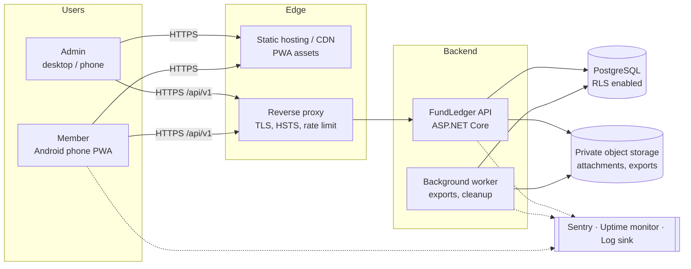

# FundLedger — Technical Requirements Document (TRD)

| Item | Value |
|---|---|
| Document | TRD v1.0 |
| Derived from | `FundLedger_Complete_PRD_v1.1.docx` (PRD v1.1) |
| Date | 06-Oct-2026 · rev 1.1 on 07-Oct-2026 (owner decisions applied: PIN-only login, hosting, Q-03 to Q-10) |
| Status | Baseline: decisions recorded |
| Companion docs | [02-App-Flow](02-App-Flow.md) · [03-UI-UX-Design-Brief](03-UI-UX-Design-Brief.md) · [04-Backend-Schema](04-Backend-Schema.md) · [05-Implementation-Plan](05-Implementation-Plan.md) · [ADRs](adr/) |

Requirement IDs used below:
- `BR-xxx` are the business rules from PRD §23.
- `TR-xxx` are technical requirements introduced by this document.

Rule keywords follow the engineering standard the project applies: **MUST**, **MUST NOT**, **SHOULD**.

---

## 1. Purpose and scope

This document turns PRD v1.1 into buildable technical requirements: architecture, technology choices, module boundaries, API contract, security, offline sync, reporting, non-functional targets, environments and operations.

It does **not** restate product scope. In-scope and out-of-scope lists are as in PRD §3. Where the PRD leaves a decision open, this TRD makes a recommendation and records it in an ADR (§17).

---

## 2. System context



---

## 3. Architecture

### 3.1 Style

The backend is a **modular monolith**: one deployable ASP.NET Core API with clear module boundaries, plus one background worker process built from the same solution. For 50 users per organization, microservices would add cost and failure modes with no benefit (see [ADR-0001](adr/ADR-0001-technology-stack.md)).

### 3.2 Backend solution layout

```
src/
  FundLedger.Api/              HTTP layer: endpoints, auth, filters, ProblemDetails, OpenAPI
  FundLedger.Application/      use cases (commands/queries), validators, DTOs, policies
  FundLedger.Domain/           entities, value objects (Money, TxnNumber), domain rules, errors
  FundLedger.Infrastructure/   EF Core DbContext + migrations, RLS session interceptor,
                               object storage, exporters (XLSX/CSV/PDF), receipt PDF
  FundLedger.Worker/           BackgroundService host: export jobs, session/login-attempt cleanup
tests/
  FundLedger.Domain.Tests/
  FundLedger.Application.Tests/
  FundLedger.Api.IntegrationTests/   Testcontainers PostgreSQL, real RLS
```

### 3.3 Modules (domain boundaries)

| Module | Responsibility | Main PRD refs |
|---|---|---|
| Identity | Mobile + PIN login, lockout, sessions, refresh rotation, logout | §5, §22 |
| Organization | Organization profile, settings | §6.1, §21.5 |
| Users | User CRUD, activation, 50-user limit, fund access and permissions | §4, §21.1, BR-001..003 |
| Funds | Fund lifecycle (Draft → Active → Closed → Archived), fund types | §6, §21.2, BR-017 |
| Accounts | Accounts, opening balances, balance queries | §12, §21.4, BR-015 |
| Categories | Money-in and money-out categories | §8.3, §9.3, §21.3 |
| Ledger | Deposit, expense, transfer, adjustment, edit, cancel, numbering, revisions | §7–§11, §13, BR-005..014, BR-016 |
| Sync | Idempotent batch ingest of offline transactions | §19, BR-018, BR-019 |
| Attachments | Upload, scan, signed download | §18 |
| Reporting | Dashboard, the 10 reports, export jobs, Money In receipts | §15, §17, BR-020, ADR-0007 |
| Audit | Append-only audit writer and query | §14 |

Rules for module boundaries:
- A module **MUST NOT** query another module's tables directly. It calls the other module's application service instead.
- Exception: Reporting may read the ledger SQL views (`v_*`) directly.

### 3.4 Frontend architecture (PWA)

```
web/
  src/
    app/            routing, providers, layout shells (mobile bottom-nav, desktop sidebar)
    features/       auth, dashboard, ledger, txn-forms, reports, admin/*, sync
    components/ui/  design-system primitives (shadcn/ui based)
    lib/api/        typed API client (generated from OpenAPI), auth token handling
    lib/offline/    Dexie (IndexedDB) stores, outbox, sync engine
    lib/format/     INR formatting, dates in org timezone
    sw/             service worker (Workbox via vite-plugin-pwa)
```

Frontend data rules:
- Server state lives in TanStack Query.
- Form state uses React Hook Form with Zod schemas. The schemas mirror the API validators and are generated from OpenAPI where possible.
- Global client state, such as the selected fund and theme, lives in a small Zustand store.

---

## 4. Technology stack

Versions MUST be pinned in lock files at project setup. The table states the major line expected on 06-Oct-2026.

| Layer | Choice | Notes |
|---|---|---|
| Frontend | React 19 + TypeScript (strict) + Vite | PRD §26.1 |
| UI | Tailwind CSS v4 + shadcn/ui (Radix primitives) + lucide-react icons | Accessible primitives |
| Forms / validation | React Hook Form + Zod | Same rules as server |
| Server state | TanStack Query | Cache scoped per org + fund key |
| Offline | Dexie.js over IndexedDB, Workbox service worker (vite-plugin-pwa) | PRD §19 |
| Charts | Recharts | Dashboard only |
| Backend | ASP.NET Core on **.NET 10 (LTS)** | PRD §26.1 |
| ORM | EF Core 10 + Npgsql, `EFCore.NamingConventions` (snake_case) | |
| Validation | FluentValidation | Request schemas (Standard §3.1) |
| Auth plumbing | ASP.NET Core JWT bearer + Data Protection; ASP.NET Core Identity `PasswordHasher` for PINs | No custom crypto; no OTP/SMS in V1 (ADR-0002) |
| Database | PostgreSQL 16+ on Neon | ADR-0006 |
| Object storage | Cloudflare R2, private buckets (MinIO locally) | Attachments + export files (ADR-0006) |
| Exports / receipts | ClosedXML (XLSX), CsvHelper (CSV), QuestPDF (PDF exports + receipts) | Verify the QuestPDF licence tier at setup |
| Logging | Serilog with JSON output and request-ID enricher | Standard §8.2–8.3 |
| Tracing / metrics | OpenTelemetry (ASP.NET Core, EF Core, HttpClient) | |
| Error tracking | Sentry (API + PWA) | Standard §8.1 |
| Uptime | External multi-region monitor (e.g. Better Stack) | Standard §8.5 |
| Product analytics | PostHog, events only, no PII | Standard §8.1 |
| CI/CD | GitHub Actions | Standard §7.3 |
| Tests | xUnit, FluentAssertions, Testcontainers (API); Vitest + Testing Library (web); Playwright (E2E) | |

---

## 5. Multi-tenancy and authorization model

### 5.1 Tenancy

- Isolation model: **shared schema + `organization_id` on every tenant table + PostgreSQL Row-Level Security** ([ADR-0003](adr/ADR-0003-tenant-isolation-rls.md)).
- V1 is deployed for one organization. The model is SaaS-ready (PRD §30) without a later rewrite.

**TR-001** — The API MUST connect as `fundledger_app`. That role is not the table owner and has no `BYPASSRLS`. Migrations run as `fundledger_owner`, from CI only.

**TR-002** — On every pooled connection open, the API MUST set the session context: `app.org_id`, `app.user_id` and `app.is_admin`.
- This is done with an EF Core `DbConnectionInterceptor` calling `set_config(..., false)`.
- When a connection is returned to the pool, the context MUST be cleared. Npgsql's `DISCARD ALL` on reset already does this.
- Unauthenticated requests run with an empty context, so they can see no tenant rows.

**TR-003** — Pre-authentication lookups (PIN login and refresh) MUST go through the `SECURITY DEFINER` functions `fl.auth_find_user_by_mobile` and `fl.auth_find_session`. RLS is never disabled for them.

### 5.2 Roles and permissions

| Capability | Admin | Member (per-fund flag) |
|---|---|---|
| View assigned fund, dashboard, ledger | ✅ all funds | ✅ assigned funds (`user_fund_access` row) |
| See other users' transactions | ✅ | `can_view_all_txns` (default true) |
| Money In | ✅ | `can_money_in` |
| Money Out | ✅ | `can_money_out` |
| Transfer | ✅ | `can_transfer` (default false) |
| Adjustment | ✅ only | ❌ (BR-016) |
| Edit own transaction within edit window | ✅ | ✅ own only, within `txn.edit_window_minutes` (default 15) |
| Edit any transaction / after window | ✅ with reason | ❌ |
| Cancel transaction | ✅ with reason | ❌ Admin only (decision Q-04) |
| Reports | ✅ | `can_view_reports` |
| Export | ✅ | `can_export` |
| Money In receipt (PDF / share) | ✅ | Any deposit the user can view (ADR-0007) |
| Users, funds, accounts, categories, opening balances, settings | ✅ | ❌ |
| Audit log | ✅ | ❌ |

**TR-004** — Authorization is checked in three places:
1. ASP.NET Core authorization policies at the endpoint (role).
2. An application-layer `IFundAccessGuard` (fund and permission flag).
3. PostgreSQL RLS (tenant and fund), as the last line of defence.

A hidden UI button is not access control (BR-020, Standard §2.6).

**TR-005** — Every authorization rule MUST have an integration test that logs in as user A and tries user B's resource or fund by changing IDs. The expected result is `404` for a resource in another tenant or fund, and `403` for a function the user is not allowed to call.

### 5.3 Caching

- **TR-006** — Any server-side cache key MUST include the `organization_id`. Fund-scoped keys MUST also include the `fund_id`.
- Permission and user-status data MUST NOT be cached longer than one request. Revocation must take effect immediately (Standard §6.17).

---

## 6. Authentication

Details and alternatives: [ADR-0002](adr/ADR-0002-authentication.md).

### 6.1 Login flow (mobile + PIN)

V1 has no OTP and no SMS. This is the product owner's decision of 07-Oct-2026.

```mermaid
sequenceDiagram
  participant P as PWA
  participant A as API
  participant D as DB
  P->>A: POST /api/v1/auth/login {mobile, pin}
  A->>A: normalize to E.164; IP rate limit
  A->>D: count recent failures in login_attempts for mobile
  alt locked (>= 5 failures in 15 min)
    A->>D: insert login_attempts(failed, LOCKED)
    A-->>P: 429 ACCOUNT_LOCKED + Retry-After
  else not locked
    A->>D: auth_find_user_by_mobile()
    A->>A: PasswordHasher verify (dummy hash when user unknown, to equalize timing)
    alt active user and PIN correct
      A->>D: insert login_attempts(success); create user_sessions; update last_login_at; audit LOGIN
      A-->>P: 200 {accessToken, expiresIn, user, pinMustChange} + Set-Cookie fl_rt (HttpOnly, Secure, SameSite=Strict)
    else unknown / inactive / wrong PIN
      A->>D: insert login_attempts(failed); audit LOGIN_FAILED (known users only)
      A-->>P: 401 INVALID_CREDENTIALS (identical body for every case)
    end
  end
```

If `pinMustChange` is true, the session is **restricted**: only `POST /auth/pin/change`, `POST /auth/logout` and `GET /me` are allowed until the user sets their own PIN.

### 6.2 Requirements

| ID | Requirement | Ref |
|---|---|---|
| TR-010 | No self-registration endpoint exists. Users are created only via `POST /users` (Admin), with a temporary PIN set by the Admin. | BR-002 |
| TR-011 | Login failures return one generic response, `401 INVALID_CREDENTIALS` ("Mobile number or PIN is incorrect."), for unknown numbers, inactive users and wrong PINs. Timing is equalized by verifying against a dummy hash when the user is unknown. | BR-003 |
| TR-012 | PINs are exactly 6 digits, hashed with ASP.NET Core Identity `PasswordHasher` (PBKDF2), and rehashed automatically when the hasher version changes. Weak PINs are rejected at change time: all-same digits, straight sequences, the last 6 digits of the user's own mobile, and a denylist of common PINs. | §5.3, BR-004 |
| TR-013 | Lockout is per mobile: `auth.pin_max_failures` (default 5) failures within `auth.pin_lockout_minutes` (default 15) lock that mobile number, counted from `login_attempts` after the user's `pin_set_at`. Unknown numbers lock the same way, so a lockout does not reveal registration. There is also a per-IP limit of 20 attempts per 15 min. Responses are `429` with `Retry-After`. | §5.4, §22 |
| TR-014 | Access token: JWT signed with an asymmetric key (ES256), **15-minute** lifetime. It is held in memory only, never in `localStorage`. | Standard §2.7 |
| TR-015 | Refresh token: an opaque 256-bit random value in an HttpOnly cookie. Only its SHA-256 hash is stored. Its lifetime ends after **8 h idle** or **7 days absolute**, both configurable. It is **rotated on every use**. If a rotated token is used again, the whole token family is revoked. | Standard §2.7, §2.9 |
| TR-016 | Logout revokes the session on the server. Each of these revokes **all** of the user's sessions: deactivating the user, an Admin PIN reset, and the user changing their own PIN (except the session making the change). Admins can list and revoke a user's active sessions. | §5.4, Standard §2.8 |
| TR-017 | PINs, refresh tokens and JWTs MUST NOT appear in logs, traces, Sentry breadcrumbs or audit values. Serilog destructuring policies mask them. | §22 |
| TR-018 | PIN lifecycle: the Admin sets a temporary PIN when creating the user, or on reset (`pin_must_change = true`). The user must change it at first login. "Forgot PIN" means an Admin reset; there is no self-service reset. | §5.3 |
| TR-019 | Login, logout, failed login (known users), lockout, PIN change, PIN reset and session revocation all write audit events. | §14.2 |
| TR-020 | Signing keys are kept in a secrets manager or environment, never in the repo. Key rotation is supported through a `kid` header with two active keys. | Standard §1 |

### 6.3 Offline and authentication

An expired access token MUST NOT block offline data entry. Queued transactions are synced after the user's session refreshes.

If the refresh token is also expired, the outbox is kept in IndexedDB until the user logs in again:
- The outbox is bound to the `user_id` it was created under.
- It is **never** submitted under a different user's session.

---

## 7. Ledger engine

### 7.1 Transaction types

| Type | Account fields | Category | Effect on account | Effect on fund total |
|---|---|---|---|---|
| DEPOSIT | `account_id` | MONEY_IN category | + amount | + amount |
| EXPENSE | `account_id` | MONEY_OUT category | − amount | − amount |
| TRANSFER | `from_account_id`, `to_account_id` | none | −from / +to | 0 (BR-011) |
| ADJUSTMENT | `account_id` + `adjustment_direction` | optional | ± amount | ± amount |

### 7.2 Write path

All writes go through one application service. The steps run inside a single DB transaction at `READ COMMITTED`:

1. Validate the request (FluentValidation): shape, `amount > 0`, max amount, decimals ≤ 2, and string lengths.
2. Load the fund and check that it is `ACTIVE` (BR-017).
3. Check the caller's permission for this fund and transaction type.
4. Validate references:
   - The category is active, matches the direction, and is in scope for the fund.
   - The accounts are active.
   - The payment mode is active, and a reference number is present if the mode requires one.
5. Check the date rules:
   - `txn_date` must not be later than today in the org timezone.
   - A Member may backdate at most `txn.backdate_days_member` days (default 7; decision Q-03).
   - Admins have no backdating limit.
6. Allocate the transaction number with `INSERT ... ON CONFLICT DO UPDATE ... RETURNING` on `txn_number_sequences`. The row lock serializes allocations for each fund.
7. Insert the transaction and revision 1 into `transaction_revisions`, and write the `TXN_CREATED` audit event.
8. Commit, then return `201` with the full transaction and the new fund balance.

The database repeats the critical rules as CHECK constraints and triggers (see [04-Backend-Schema](04-Backend-Schema.md)). If the API has a bug, the database still rejects invalid data.

### 7.3 Numbering

- Format: `{FUNDCODE}-{FY}-{SEQ6}`, for example `IJT26-2026-27-000123`.
- `FY` follows the Indian financial year (April–March) by default. The `txn.number_period` setting can switch it to calendar year.
- Numbers are gap-free per fund and period. Cancelled transactions keep their number.
- Offline transactions have no number until they are synced. The UI shows "Pending" until then.

### 7.4 Edit and cancel

**TR-030 — Edit**
- Only these fields are editable: amount, date/time, category, account(s), payment mode, parties, purpose, reference, remarks and adjustment direction.
- These fields are immutable: type, fund, number, creator and client ID. A database trigger enforces this.
- A change reason is mandatory when the editor is an Admin, or when the edit is outside the edit window.
- Every edit writes a new full snapshot to `transaction_revisions` and an audit event with old and new values (BR-014).

**TR-031 — Optimistic concurrency.** Edit and cancel requests must send `If-Match: "<revision>"`. If the revision is stale, the API returns `412 Precondition Failed`.

**TR-032 — Cancel**
- Cancelling sets `status = CANCELLED` and records the reason, the user and the time.
- A cancelled transaction is terminal: it cannot be edited or un-cancelled. To correct one, create a new transaction.
- Cancelled transactions are excluded from balances by the views (§14.4).

**TR-033 — No delete.** No `DELETE` endpoint exists for transactions, revisions, attachments or audit logs. The database role has no `DELETE` privilege on these tables (BR-012).

### 7.5 Balances

- Balances are **computed, never stored** in V1. They come from the views `v_fund_account_balances` and `v_fund_balances` ([ADR-0004](adr/ADR-0004-balance-model.md)).
- At V1 volumes (tens of thousands of rows per fund), this stays well under the 2 s target with the indexes defined.
- **TR-034** — If p95 for `GET /dashboard` goes above 500 ms in production, introduce a per-(fund, account, day) summary table. It MUST be maintained in the same transaction as the ledger write and verified nightly against the views. This is a deliberate decision, not a default cache.

---

## 8. Offline and synchronization (PRD §19)

### 8.1 Scope

These actions are allowed offline:
- Create Money In, Money Out and Transfer.
- Attach photos to transactions that are still queued.

Edit, cancel, adjustment, opening balance and all admin functions require a connection. The UI disables these actions while offline and explains why.

### 8.2 Client design

| Store (IndexedDB) | Purpose |
|---|---|
| `outbox` | Queued commands: `{clientTxnId (UUIDv7), userId, orgId, fundId, type, payload, attachments[], createdAt, attempts, lastError, state}` |
| `refdata` | Snapshot of the user's funds, accounts, categories and payment modes, used to fill offline form dropdowns. Refreshed on every successful online load. |
| `ledgerCache` | The last 200 transactions per fund, for read-only offline viewing |

Offline entry flow:
1. On save, the client validates the form locally (same Zod schema) and writes it to `outbox` with `state = PENDING`.
2. The UI shows the entry immediately with a "Pending sync" badge.
3. The sync engine runs when any of these happens:
   - the `online` event fires
   - the app starts
   - the user taps "Sync now"
   - every 60 s while there are pending items
4. Background Sync API, where supported, is a progressive enhancement only. The engine does not depend on it.
5. Failed attempts are retried with exponential backoff, capped at 15 min.

### 8.3 Server contract

`POST /api/v1/sync/transactions` accepts up to 50 commands. Each command carries its `clientTxnId`, and each one is processed independently in its own DB transaction.

Response per item:

| Result | Meaning | Client action |
|---|---|---|
| `CREATED` | Inserted. Returns the server transaction and number. | Mark synced, replace the local row |
| `DUPLICATE` | `clientTxnId` already exists (BR-019). Returns the existing transaction. | Mark synced |
| `REJECTED` | Business rule failed, e.g. fund closed, permission revoked, category inactive or amount limit. Returns an error code. | Mark `NEEDS_ATTENTION` and show it to the user to fix or discard. **Never retried automatically.** |
| `RETRY` | Transient server error | Backoff and retry |

Server-side rules:
- **TR-040** — Idempotency is guaranteed by the unique constraint `(organization_id, client_txn_id)`. If two parallel syncs of the same item race, the losing one returns `DUPLICATE`, not an error.
- **TR-041** — The server re-validates everything at sync time against the current state. The server is the source of truth. If the fund was closed while the device was offline, the item is `REJECTED` with `FUND_NOT_ACTIVE`; it is not silently forced in.
- **TR-042** — `client_created_at` is stored for audit purposes. `txn_date` and `txn_time` are what the user entered. The device clock is never trusted for `created_at`.
- **TR-043** — An outbox older than `offline.max_queue_age_hours` (default 72) still syncs, but the transactions are flagged in the audit log for Admin attention.

---

## 9. Attachments (PRD §18)

| ID | Requirement |
|---|---|
| TR-050 | Allowed types (configurable): `image/jpeg`, `image/png`, `image/webp`, `application/pdf`. Max size `attachments.max_mb`, default 5 MB. Max 5 attachments per transaction. |
| TR-051 | The server checks magic bytes and does not trust `Content-Type`. Images are re-encoded server-side, which strips EXIF data including GPS location. PDFs are stored as uploaded. Antivirus scanning (ClamAV) is a SHOULD for V1.1. |
| TR-052 | Before upload, the client compresses images to at most 1600 px on the long edge at JPEG quality 0.8. This keeps 2G/3G uploads usable. |
| TR-053 | Files are stored in a private bucket under the key `org/{org}/fund/{fund}/txn/{txn}/{uuid}.{ext}`. Downloads go through `GET /attachments/{id}`, which checks authorization and then redirects to a **pre-signed URL that expires in 60 seconds**. Bucket objects are never public. |
| TR-054 | Attachments are never deleted. An Admin can *hide* one with a reason, which is audited. Cancelling a transaction keeps its attachments. |
| TR-055 | Offline: attachments are kept in IndexedDB as Blobs, at most 3 per transaction. They are uploaded after the transaction syncs. |

---

## 10. Reporting and export (PRD §15, §17)

### 10.1 Reports

All reports take the same parameters: `fundId` (required), `from`, `to`, and optional filters (`type`, `categoryId`, `accountId`, `userId`, `paymentModeId`, `status`).

| Code | Report | Core query |
|---|---|---|
| FUND_SUMMARY | Fund Summary | `v_fund_balances` plus breakdowns by type and category |
| DAILY | Daily Summary | Per-day in, out, transfers and net, plus closing balance per day |
| DATE_RANGE | Date Range Summary | Opening balance at `from`, movements, closing balance at `to` |
| MONEY_IN | Money-In Report | List of deposits with totals |
| MONEY_OUT | Money-Out Report | List of expenses with totals |
| TRANSFER | Transfer Report | List of transfers by account pair |
| USER_ACTIVITY | User Activity | Per user: in, out, transfers, count (PRD §17.2) |
| CATEGORY | Category-wise | Totals by category and direction |
| ACCOUNT_BALANCE | Account Balance | `v_fund_account_balances` as of a date |
| CANCELLED | Cancelled Transactions | Cancelled transactions with the user and reason |

Report rules:
- **TR-060** — The date-range opening balance is the fund opening balance plus all active movements dated before `from`.
- **TR-061** — Every report applies the same RLS and permission rules as the ledger (BR-020). A Member without `can_view_all_txns` sees only their own rows, and totals are computed over that same scope. The report is labelled "My transactions only".

### 10.2 Export

- **TR-062** — Exports run asynchronously:
  1. `POST /exports` creates an `export_jobs` row and returns `202 {jobId}`. The request must carry an `Idempotency-Key`.
  2. The worker generates the file, uploads it to the private bucket, and sets `SUCCEEDED`.
  3. The client polls `GET /exports/{id}` and then downloads the file through a 60 s pre-signed URL.
  4. Files expire after 24 h.
- This keeps file generation out of the request cycle (Standard §9.1).
- **TR-063** — Each export writes an `EXPORT_PERFORMED` audit event recording the report, format, parameters and row count.
- **TR-064** — PDFs carry a footer with: org name, fund, period, "Generated by {user} at {time}", page X/Y. Amounts use Indian digit grouping.

### 10.3 Money In receipts (ADR-0007)

- **TR-065** — `GET /transactions/{id}/receipt.pdf` returns a one-page A5 PDF for **DEPOSIT** transactions only. Any other type returns `400 RECEIPT_NOT_AVAILABLE`.
  - The receipt is generated on demand from the current revision and never stored.
  - Authorization is the same as `GET /transactions/{id}`.
- **TR-066** — Receipt content:
  - organization name, address and registration number
  - receipt no. = transaction number, and the date
  - received from
  - amount in figures and **in words, Indian system** ("Rupees One Lakh Twenty-Five Thousand Only"; paise included when non-zero)
  - fund, category, purpose, payment mode and reference
  - "Recorded by" (configurable), the footer text, and a generated-at time
  - an 8-character verification code (HMAC of transaction ID + revision)

  The receipt must not claim any tax benefit (no 80G wording).
- **TR-067** — State markers:
  - Edited transactions show "Revised (rev n)".
  - Cancelled transactions are watermarked **CANCELLED** with the cancellation date.
  - Queued offline entries cannot produce a receipt until they are synced.
- **TR-068** — Each generation writes the `RECEIPT_GENERATED` audit event with the revision. Rate limit: 60 receipts per hour per user.
- **TR-069** — Performance: p95 under 1 s. If this is exceeded, move receipts to the async export pipeline (ADR-0007).

---

## 11. API specification

### 11.1 Conventions

- Base path: `/api/v1`. JSON only, `camelCase`.
- Dates: `YYYY-MM-DD`. Times: `HH:mm`. Timestamps: ISO-8601 UTC.
- Amounts: **decimal strings**, for example `"25000.00"`, so there is no float rounding in JavaScript.
- Errors use RFC 9457 ProblemDetails, with a stable `code` (e.g. `FUND_NOT_ACTIVE`) and a `traceId`. No stack traces, SQL or internal paths are returned (Standard §3.7).
- Pagination is keyset (cursor) based: `?cursor=&limit=` with a default of 50 and a max of 200. The response includes `nextCursor`.
- Every mutating `POST` accepts an `Idempotency-Key` header. Transaction creation also accepts `clientTxnId` in the body. Online and offline flows share the idempotency path.
- `X-Request-Id` is echoed back on every response, or generated if the client did not send one.
- An OpenAPI 3.1 document is generated from the code and published at `/api/v1/openapi.json` in non-production. The TypeScript client is generated from it.

### 11.2 Endpoints

PRD §25 is the baseline. Additions are marked ➕.

| Method | Path | Role | Notes |
|---|---|---|---|
| POST | `/auth/login` | public | Mobile + PIN. Replaces PRD `/auth/send-otp` + `/auth/verify-otp` (ADR-0002). |
| POST | `/auth/pin/change` ➕ | user | Current PIN + new PIN; allowed in a restricted session |
| POST | `/auth/refresh` | cookie | Rotates the refresh token |
| POST | `/auth/logout` | user | Revokes the session server-side |
| GET | `/me` ➕ | user | Profile, role, accessible funds with permission flags, org settings needed by the client |
| GET | `/users` | admin | Filters: status, role, q |
| POST | `/users` | admin | 409 `ACTIVE_USER_LIMIT_REACHED` |
| PUT | `/users/{id}` | admin | |
| PATCH | `/users/{id}/status` | admin | Deactivation revokes sessions |
| PUT | `/users/{id}/fund-access` | admin | PRD `/permissions`; replaces the full list of `{fundId, flags}` |
| POST | `/users/{id}/reset-pin` ➕ | admin | Sets a temporary PIN and revokes the user's sessions |
| GET | `/users/{id}/sessions` ➕ | admin | Active sessions (device, last used) |
| POST | `/users/{id}/sessions/revoke` ➕ | admin | Revoke one session or all |
| GET | `/organization` | user | PRD `/organizations` (single tenant per user) |
| PUT | `/organization` ➕ | admin | |
| GET / PUT | `/settings` ➕ | admin | Typed settings DTO |
| GET | `/funds` | user | Only accessible funds |
| POST | `/funds` | admin | |
| PUT | `/funds/{id}` | admin | |
| POST | `/funds/{id}/activate` ➕ | admin | DRAFT → ACTIVE |
| POST | `/funds/{id}/close` | admin | Reason optional |
| POST | `/funds/{id}/reopen` | admin | Reason required |
| POST | `/funds/{id}/archive` ➕ | admin | CLOSED → ARCHIVED |
| GET / PUT | `/funds/{id}/opening-balances` ➕ | admin (PUT) | Per account; reason required on change (BR-015) |
| GET | `/fund-types` ➕, `/payment-modes` ➕ | user | POST/PUT are admin only |
| GET | `/accounts` | user | |
| POST / PUT | `/accounts`, `/accounts/{id}` | admin | |
| GET | `/accounts/balances?fundId=` ➕ | user | |
| GET | `/categories?direction=&fundId=` | user | |
| POST / PUT | `/categories`, `/categories/{id}` | admin | |
| POST | `/transactions/deposit` | perm | |
| POST | `/transactions/expense` | perm | |
| POST | `/transactions/transfer` | perm | |
| POST | `/transactions/adjustment` | admin | |
| GET | `/transactions` | user | Search, filters and sort per PRD §16 |
| GET | `/transactions/{id}` | user | Includes revisions and attachments |
| GET | `/transactions/{id}/history` ➕ | user | Revision diff list |
| GET | `/transactions/{id}/receipt.pdf` ➕ | user | DEPOSIT only (TRD §10.3, ADR-0007) |
| PUT | `/transactions/{id}` | perm | `If-Match` required |
| POST | `/transactions/{id}/cancel` | admin | `If-Match`, reason required |
| POST | `/sync/transactions` ➕ | user | Batch offline ingest (§8.3) |
| POST | `/transactions/{id}/attachments` | perm | multipart |
| GET | `/attachments/{id}` | user | 302 to a pre-signed URL |
| POST | `/attachments/{id}/hide` ➕ | admin | |
| GET | `/dashboard?fundId=` | user | |
| GET | `/reports/{code}?fundId=&from=&to=&...` | perm | The 10 report codes in §10.1 |
| POST | `/exports` ➕, GET `/exports/{id}` ➕ | perm | Async export |
| GET | `/audit-logs` | admin | Filters: user, action, entity, date |
| GET | `/health/live`, `/health/ready` ➕ | public | Ready checks the DB, storage and migration version |

### 11.3 Example: create deposit

```http
POST /api/v1/transactions/deposit
Authorization: Bearer <jwt>
Content-Type: application/json

{
  "clientTxnId": "01928f3e-6b1a-7c2d-9e0f-1a2b3c4d5e6f",
  "fundId": "…",
  "amount": "25000.00",
  "txnDate": "2026-10-05",
  "txnTime": "10:00",
  "categoryId": "…",
  "accountId": "…",
  "paymentModeId": "…",
  "receivedFrom": "Area 4 collection team",
  "purpose": "Ijtema Collection",
  "referenceNumber": null,
  "remarks": null
}
```

```http
201 Created
ETag: "1"
{
  "id": "…", "txnNumber": "IJT26-2026-27-000001", "type": "DEPOSIT", "status": "ACTIVE",
  "amount": "25000.00", "revision": 1,
  "createdBy": { "id": "…", "name": "Ahmed" }, "createdAt": "2026-10-05T04:30:12Z",
  "fundBalance": { "closing": "31400.00" }
}
```

### 11.4 Error codes (stable contract)

`VALIDATION_FAILED`, `UNAUTHENTICATED`, `FORBIDDEN`, `NOT_FOUND`, `RATE_LIMITED`, `INVALID_CREDENTIALS`, `ACCOUNT_LOCKED`, `PIN_CHANGE_REQUIRED`, `PIN_TOO_WEAK`, `USER_INACTIVE`, `ACTIVE_USER_LIMIT_REACHED`, `FUND_NOT_ACTIVE`, `CATEGORY_INACTIVE`, `CATEGORY_DIRECTION_MISMATCH`, `ACCOUNT_INACTIVE`, `TRANSFER_SAME_ACCOUNT`, `AMOUNT_OUT_OF_RANGE`, `DATE_IN_FUTURE`, `BACKDATE_LIMIT_EXCEEDED`, `EDIT_WINDOW_EXPIRED`, `REASON_REQUIRED`, `REVISION_CONFLICT`, `TXN_CANCELLED_IMMUTABLE`, `ATTACHMENT_TYPE_NOT_ALLOWED`, `ATTACHMENT_TOO_LARGE`, `EXPORT_NOT_READY`, `RECEIPT_NOT_AVAILABLE`.

---

## 12. Security requirements

Covers PRD §22, plus the engineering standard.

| ID | Requirement |
|---|---|
| TR-070 | HTTPS only. TLS 1.2+, HSTS (`max-age=31536000; includeSubDomains`). HTTP redirects to HTTPS. |
| TR-071 | CORS uses a hard-coded allowlist of the PWA origins per environment. Credentials are allowed only for those origins. Wildcards are never used. |
| TR-072 | Security headers: CSP with `default-src 'self'`, script hashes only and `connect-src` limited to the API + Sentry + PostHog; `X-Content-Type-Options: nosniff`; `Referrer-Policy: strict-origin-when-cross-origin`; `Permissions-Policy` that disables everything except camera, which is needed to photograph bills; `frame-ancestors 'none'`. |
| TR-073 | Rate limiting uses the ASP.NET Core `RateLimiter`. The login endpoint uses the TR-013 limits. Authenticated users are limited to 300 req/min. Exports are limited to 10 per hour per user. A reverse-proxy limit sits in front as an abuse backstop. |
| TR-074 | Every request DTO is validated. Unknown JSON properties are rejected (`UnmappedMemberHandling.Disallow`). |
| TR-075 | Secrets come only from environment or a secrets manager: DB passwords, JWT keys, receipt HMAC key, storage keys, Sentry DSN (server). `.env*` files are git-ignored before the first commit. Gitleaks runs in CI and GitHub push protection is enabled. |
| TR-076 | Least-privilege DB roles as in [04-Backend-Schema §8](04-Backend-Schema.md). The app role has no DDL rights and no `DELETE` on financial or audit tables. |
| TR-077 | PII minimization. The system stores only name, mobile and optional email. Mobile numbers are masked in logs (`+91******0002`). Audit `old_value`/`new_value` never contain secrets. |
| TR-078 | Dependency scanning: `dotnet list package --vulnerable` and `npm audit` run in CI and fail on high or critical findings. Dependabot is enabled. |
| TR-079 | An OWASP ZAP baseline scan runs against staging before the first production release and before each major release. |
| TR-080 | The PWA bundle contains no secrets. Database credentials are never in the client (PRD §22). |

---

## 13. Non-functional requirements

| Area | Target | Verification |
|---|---|---|
| API latency | p95 < 300 ms for CRUD; p95 < 2 s for reports over one fund-year (PRD §27) | k6 load test on staging: 50 virtual users, 10 min |
| PWA performance | LCP < 2.5 s on a mid-range Android over 4G; JS bundle < 250 KB gzip for first route | Lighthouse CI on PRs |
| Entry speed | A Money In entry takes ≤ 30 s from tapping "+ Money In" to the success toast (PRD §15.3) | Timed UAT task with 5 users |
| Availability | 99.5 % monthly for the API (single region, 1 instance plus fast restart) | External uptime monitor |
| Data durability | RPO ≤ 15 min (PITR); RTO ≤ 4 h | Quarterly restore drill (§15.3) |
| Capacity | 50 active users per org; ~500 transactions per day peak per fund; 1 M transactions in total without schema change | Seeded load data |
| Accessibility | WCAG 2.2 AA | axe in Playwright + manual screen-reader pass |
| Browser support | Chrome/Edge (last 2), Android Chrome 110+, Samsung Internet (last 2), Safari iOS 16.4+ (best effort for install) | Playwright projects |
| Localization | English for V1. All strings externalized (i18next). Layout ready for RTL (Urdu) and Devanagari (Hindi). | Lint rule: no hard-coded JSX strings |

---

## 14. Data integrity rules (DB-enforced)

The database enforces these rules itself, in addition to the API:

1. Amount > 0 with 2 decimals (BR-005).
2. Shape constraints per transaction type (BR-008, BR-009, BR-010).
3. A cancellation must carry a reason, the user and the time (BR-013).
4. Unique `(org, client_txn_id)` (BR-019).
5. Inserts and updates are rejected when the fund is not `ACTIVE` (BR-017).
6. Identity fields of a transaction are immutable, and a cancelled transaction is terminal.
7. The active-user limit is enforced with an advisory lock (BR-001).
8. The audit log and revisions are append-only.
9. Tenant and fund isolation are enforced through RLS.

`database/verify_schema.sql` asserts all of these. It MUST run in CI against every migration.

---

## 15. Environments, deployment and operations

### 15.1 Environments

| Env | Purpose | Data | URL (proposed) |
|---|---|---|---|
| local | Developer | Seed data, Docker Compose (Postgres + MinIO + Mailpit) | `localhost` |
| preview | Per-PR PWA preview (static) against the staging API | Staging | `pr-<n>.fundledger-preview…` |
| staging | Integration, UAT, ZAP, load tests | Synthetic plus anonymized copies; its own DB branch | `staging.<domain>` |
| production | Live | Real | `app.<domain>`, `api.<domain>` |

Rules:
- Staging and production MUST NOT share databases, buckets, JWT keys or receipt HMAC keys (Standard §7.1).
- Staging uses only synthetic users and mobile numbers.

### 15.2 CI/CD (GitHub Actions)

```
PR opened → lint · typecheck · unit tests · API integration tests (Testcontainers)
           · schema verify (schema.sql + verify_schema.sql) · gitleaks · dependency audit
           · Lighthouse CI · build PWA preview
merge to main → build images (tagged with SHA) → run migrations on staging (owner role)
           → deploy staging → smoke tests (Playwright @smoke) → ZAP baseline (nightly)
release tag v* → manual approval (GitHub Environment "production")
           → migrations (expand-only) → deploy prod → smoke → keep previous image for rollback
```

Pipeline rules:
- **TR-090** — `main` is protected. It requires PRs, passing checks and linear history. Nobody pushes directly.
- **TR-091** — Rollback means redeploying the previous image tag. It must take ≤ 2 min, and this MUST be rehearsed on staging before go-live.
  - Migrations are expand-and-contract, so the previous image keeps working against the new schema.
  - A destructive (contract) migration ships at least one release *after* the code stops using the old structure (Standard §6.13).
- **TR-092** — Every migration PR includes a written rollback note and is tested against a fresh branch of the staging DB (Standard §6.14–6.15).

### 15.3 Backup and restore

- PITR with continuous WAL, retained 7 days or more. This is provided by the managed Postgres.
- A nightly `pg_dump` (custom format, encrypted) goes to object storage at a **different provider/region**, retained for 30 daily and 12 monthly copies.
- Restore drill: quarterly. Restore into a scratch database, run `verify_schema.sql`-style checks, and reconcile fund balances against the last report. The result is recorded in `docs/ops/restore-log.md`.

### 15.4 Observability

| ID | Requirement |
|---|---|
| TR-095 | Structured JSON logs with `timestamp`, `level`, `requestId`, `userId`, `orgId`, `route`, `status` and `elapsedMs`. Never the request or response body for auth routes. |
| TR-096 | Sentry runs in the API and the PWA, with release tagging and source maps uploaded privately. User context is the user ID only, with no phone number. |
| TR-097 | An external uptime monitor checks `/health/ready` every minute from 2 or more regions. The status page is hosted on the monitor vendor. |
| TR-098 | Business alerts: 0 transactions in 24 h on an active fund during its date range, a spike in sync `REJECTED`, failed logins over 50 in 15 min (possible brute force), and export failures. |
| TR-099 | Billing alerts at 50/75/90 % on hosting, DB and storage. Hard caps are set where the vendor supports them. |

---

## 16. Testing strategy

| Level | Scope | Tooling | Gate |
|---|---|---|---|
| Unit | Domain rules, Money, numbering, validators, balance math | xUnit / Vitest | 80 % line coverage on Domain + Application |
| Integration | Every endpoint against real Postgres with RLS. Two-user authorization tests (TR-005). Sync idempotency races. | Testcontainers | All pass |
| Schema | `schema.sql` + `verify_schema.sql` | psql in CI | All pass |
| E2E | Login → add in/out/transfer → ledger → report → export; offline queue → reconnect → synced | Playwright (Android Chrome emulation + desktop) | @smoke suite on every deploy |
| Accessibility | axe on every screen | Playwright + axe | 0 serious or critical |
| Load | 50 VUs on mixed traffic, plus a report burst | k6 | NFR targets met |
| Security | ZAP baseline, dependency audit, gitleaks, manual IDOR checklist | | No open high or critical findings |

---

## 17. Architecture Decision Records

| ADR | Title | Status |
|---|---|---|
| [ADR-0001](adr/ADR-0001-technology-stack.md) | Technology stack and modular monolith | Accepted (PRD-mandated) |
| [ADR-0002](adr/ADR-0002-authentication.md) | Authentication: mobile number + PIN with ASP.NET Core session tokens | Accepted 07-Oct-2026 |
| [ADR-0003](adr/ADR-0003-tenant-isolation-rls.md) | Tenant isolation with shared schema + PostgreSQL RLS | Accepted |
| [ADR-0004](adr/ADR-0004-balance-model.md) | Org-level accounts, per-(fund, account) balances, computed not stored | Accepted |
| [ADR-0005](adr/ADR-0005-offline-sync-idempotency.md) | Offline outbox with client UUIDs and server idempotency | Accepted |
| [ADR-0006](adr/ADR-0006-hosting.md) | Hosting: Neon + VPS (Docker/Caddy) + Cloudflare Pages/R2 | Accepted 07-Oct-2026 (domain pending) |
| [ADR-0007](adr/ADR-0007-money-in-receipts.md) | Money In receipts (PDF + share) in V1 | Accepted 07-Oct-2026 |

---

## 18. Product owner decisions (07-Oct-2026)

| # | Question | Decision |
|---|---|---|
| Q-01 | OTP provider? | **OTP not required. Login is mobile + PIN** (ADR-0002). |
| Q-02 | Hosting and domain? | **Recommended option approved** (ADR-0006). The domain name is still to be registered. |
| Q-03 | Can Members backdate transactions? How many days? | **7 days** (`txn.backdate_days_member = 7`) |
| Q-04 | Can Members cancel their own transaction inside the edit window? | **No. Admin only.** |
| Q-05 | Should Members see other users' transactions in the ledger by default? | **Yes** (`can_view_all_txns = true` by default) |
| Q-06 | Multiple Admins in V1? | **Allowed.** The role is per user, with no limit beyond the 50-user cap. |
| Q-07 | Max single-transaction amount? | **₹10,00,000**, configurable (`txn.max_amount`) |
| Q-08 | Financial-year or calendar-year numbering? | **Indian FY (Apr–Mar)** (`txn.number_period = FY_APR`) |
| Q-09 | Is a receipt (PDF/share) for Money In needed in V1? | **Yes.** In scope for V1 (TRD §10.3, ADR-0007). |
| Q-10 | Is there a hard event date requiring the fast-track? | **No.** The standard 13-week plan applies. |
