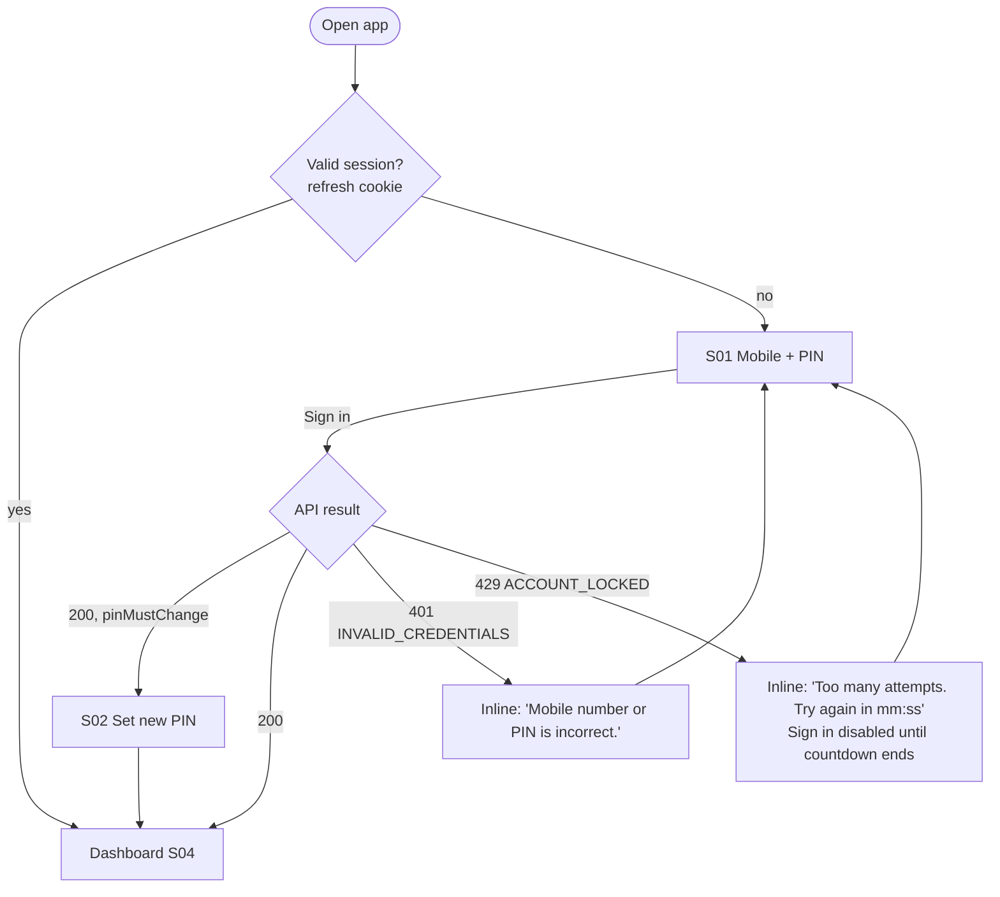
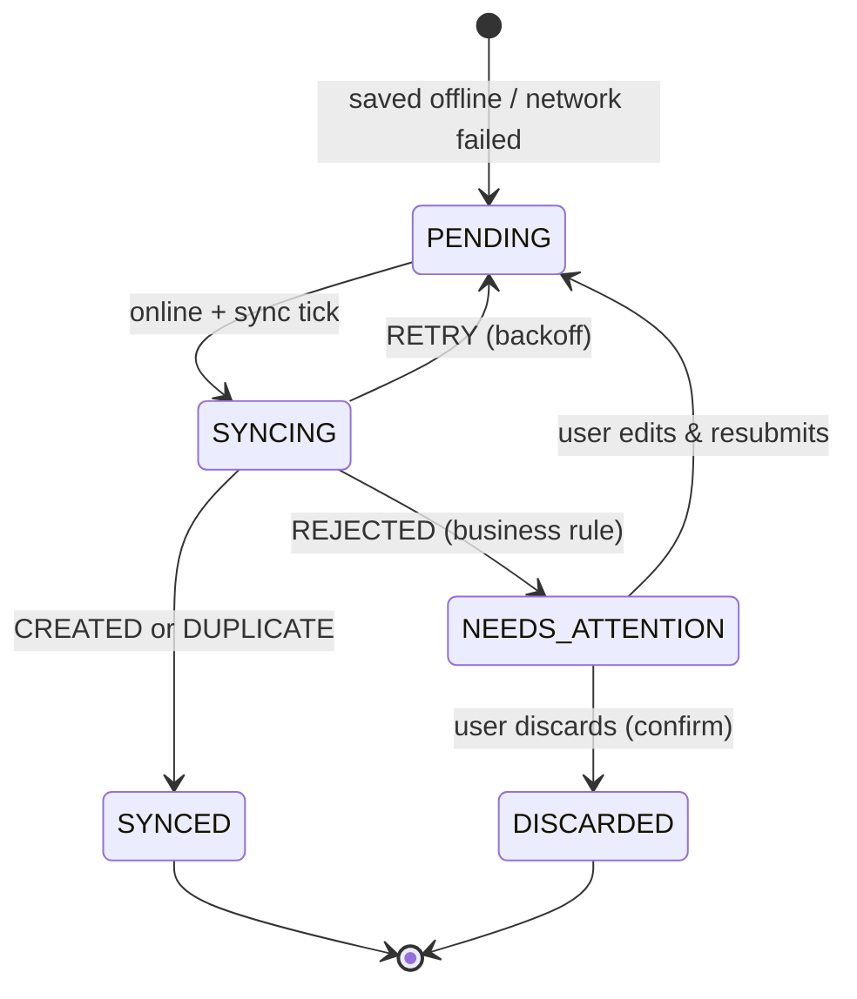
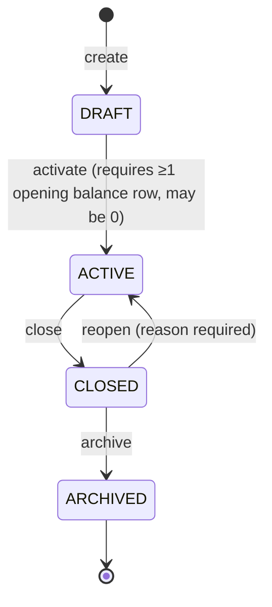

# FundLedger — App Flow (Features & Navigation Logic)

| Item | Value |
|---|---|
| Document | App Flow v1.0 |
| Derived from | PRD v1.1 · [01-TRD](01-TRD.md) |
| Date | 06-Oct-2026 · rev 1.1 on 07-Oct-2026 (PIN-only login, Money In receipts) |

This document covers four things:
- every screen in the app
- how users move between screens
- what each screen does for each role
- the state machines behind funds, transactions, users and offline sync

Screen IDs (`S01`…) are reused in the UI/UX brief and the implementation plan.

---

## 1. Screen inventory

The 15 core screens come from PRD Appendix A. Screens added by this document are marked ➕.

| ID | Screen | Route | Access | PRD |
|---|---|---|---|---|
| S01 | Login: mobile + PIN | `/login` | Public | App. A #1 (PIN replaces OTP, ADR-0002) |
| S02 | Set new PIN (first login / after reset) ➕ | `/login/set-pin` | Restricted session | §5 |
| S03 | First-run setup (bootstrap admin) ➕ | `/setup` | Bootstrap token only | §21 |
| S04 | Dashboard | `/` | All | §15 |
| S05 | Fund selector (sheet / dropdown) | overlay | All | App. A #3 |
| S06 | Ledger | `/ledger` | All | §13, §16 |
| S07 | Transaction detail | `/txn/:id` | All permitted | §13.1 |
| S08 | Add Money In | `/new/in` | `can_money_in` | §8 |
| S09 | Add Money Out | `/new/out` | `can_money_out` | §9 |
| S10 | Add Transfer | `/new/transfer` | `can_transfer` | §10 |
| S11 | Add Adjustment ➕ | `/new/adjustment` | Admin | §11 |
| S12 | Edit transaction ➕ | `/txn/:id/edit` | Owner within window / Admin | §14.3 |
| S13 | Pending sync (outbox) ➕ | `/sync` | All | §19 |
| S14 | Reports hub | `/reports` | `can_view_reports` | §17 |
| S15 | Report viewer | `/reports/:code` | `can_view_reports` | §17 |
| S16 | Exports (my downloads) ➕ | `/reports/exports` | `can_export` | §17.3 |
| S17 | More / profile ➕ | `/more` | All | — |
| S18 | Users list | `/admin/users` | Admin | §21.1 |
| S19 | User form + fund access | `/admin/users/:id` | Admin | §21.1, §6.4 |
| S20 | Funds list | `/admin/funds` | Admin | §21.2 |
| S21 | Fund form + opening balances | `/admin/funds/:id` | Admin | §21.2 |
| S22 | Accounts | `/admin/accounts` | Admin | §21.4 |
| S23 | Categories | `/admin/categories` | Admin | §21.3 |
| S24 | Payment modes & fund types ➕ | `/admin/lookups` | Admin | §21.5 |
| S25 | Audit log | `/admin/audit` | Admin | §14 |
| S26 | Settings | `/admin/settings` | Admin | §21.5 |

---

## 2. Navigation model

### 2.1 Mobile (< 768 px): bottom navigation + center action

```
┌──────────────────────────────────────┐
│ [≡ Ijtema 2026 ▾]          ⟳2  (A)   │  ← top bar: fund switcher (S05), sync badge (S13), avatar (S17)
│                                      │
│              screen body             │
│                                      │
├──────────────────────────────────────┤
│  🏠 Home   📒 Ledger   (＋)   📊 Reports   ⋯ More │
└──────────────────────────────────────┘
```

- **(＋)** opens the *Quick action sheet*. It shows **Money In**, **Money Out** and **Transfer**, plus **Adjustment** for Admins. Only actions the user has permission for on the selected fund are shown.
- **More** (S17) holds:
  - profile, theme, language (future), sync status, logout
  - for Admins, an **Administration** section linking to S18–S26
- Reports is hidden from the nav if the user has `can_view_reports = false` on the selected fund.

### 2.2 Desktop (≥ 1024 px): left sidebar

```
┌────────────┬─────────────────────────────────────────────┐
│ FundLedger │  Ijtema 2026 ▾          [+ Money In] [+ Out] [⇄]  ⟳  (A) │
│            ├─────────────────────────────────────────────┤
│ Dashboard  │                                             │
│ Ledger     │                                             │
│ Reports    │                 screen body                 │
│ ── Admin ──│                                             │
│ Users      │                                             │
│ Funds      │                                             │
│ Accounts   │                                             │
│ Categories │                                             │
│ Lookups    │                                             │
│ Audit log  │                                             │
│ Settings   │                                             │
└────────────┴─────────────────────────────────────────────┘
```

On desktop:
- Transaction forms open as a **right-side drawer** over the current page, so the user keeps their place in the ledger.
- On mobile, the same forms are full-screen routes.

The tablet layout (768–1023 px) uses the desktop structure with a collapsed sidebar (icons only).

### 2.3 Global navigation rules

| # | Rule |
|---|---|
| N-1 | **Selected fund is global context.** Dashboard, Ledger, Reports and transaction forms all act on the selected fund. The selection is saved per user in local storage and sent as `fundId` on every call. |
| N-2 | If the user has exactly one accessible fund, the fund switcher shows the fund name without a dropdown. |
| N-3 | If the user has **no** accessible funds, Members see an empty state: "You have not been assigned to any fund yet. Contact your Admin." Admins are sent to S20. |
| N-4 | If the selected fund becomes inaccessible (access revoked or fund archived), the next API call returns 404 or 403. The app then clears the selection, shows a toast and opens S05. |
| N-5 | A closed fund is still selectable and readable. Every "add" action is disabled, with the tooltip "Fund is closed". Admins also get a "Reopen fund" shortcut. |
| N-6 | Deep links (`/txn/:id`) open the fund the transaction belongs to. If the user cannot access it, they see a 404 screen that does not reveal whether the record exists. |
| N-7 | Back from a form that has unsaved input asks "Discard this entry?". Back from a saved form returns to the screen the form was opened from. |
| N-8 | Admin routes (`/admin/*`) are guarded in the client router **and** on the server. A Member typing the URL gets a 404 page. |

---

## 3. Authentication flows

### 3.1 Login (mobile + PIN)

V1 uses mobile number + 6-digit PIN. There is no OTP or SMS (ADR-0002).



Login screen behaviour:
- **S01** has two fields: mobile number and PIN.
  - The mobile number is 10 digits with a fixed `+91` prefix. The country picker is hidden in V1.
  - The PIN is 6 masked digits with a show/hide toggle, `inputmode="numeric"` and `autocomplete="current-password"`, so the browser's password manager can save it.
  - "Sign in" stays disabled until both fields are valid.
- **Every failure looks the same.** Unknown numbers, deactivated users and wrong PINs all get the same message (TRD TR-011). Below the form: *"Only members registered by your Admin can sign in."*
- **"Forgot PIN?"** opens: *"Ask your Admin to reset your PIN. They will give you a temporary PIN."* There is no self-service reset.
- **Deactivated during a session:** the next API call returns 401 `USER_INACTIVE`. The app clears its session and outbox access, and S01 shows *"Your access has been disabled. Contact your Admin."* Unsynced items stay in the outbox and are listed on S13 after the next valid login.

### 3.2 Set new PIN (S02)

S02 appears after the first login and after an Admin reset, while `pinMustChange` is true. The session is restricted: no other screen is reachable until the user sets a PIN.

- The user enters a new PIN and confirms it. Weak PINs are rejected inline: *"Choose a less predictable PIN. Avoid repeated digits, sequences like 123456, or the end of your mobile number."*
- On success, the user sees *"PIN updated."*, then the Dashboard. Any other sessions are signed out.
- **Change PIN** is also available any time from More (S17). It asks for the current PIN and the new PIN.

### 3.3 Session lifecycle

- The access token expires every 15 min. It refreshes silently through the cookie, and the user never sees this.
- After 8 h idle, or 7 days absolute, the user is sent back to S01. Unsaved form input is kept in session storage and restored after login.
- **Logout** (S17) asks for confirmation. If outbox items are pending, the confirmation warns: *"You have 3 unsynced transactions. They will sync next time you sign in on this device."*

### 3.4 First-run setup (S03)

This flow creates the very first organization and Admin.

1. The deployer runs a one-time CLI command, `fundledger bootstrap --org "Al Madad" --admin-mobile +91…`. It creates the org, the Admin and the default lookups. Alternatively, it prints a one-time setup URL (`/setup?token=…`, valid for 24 h).
2. S03 is a 3-step wizard:
   1. Organization details
   2. Confirm the Admin's name and mobile. The CLI prints a one-time temporary PIN, and the Admin must change it at first login.
   3. Seed defaults
3. Defaults seeded:
   - Accounts: Main Cash, Bank
   - Payment modes: Cash, UPI, Bank Transfer, Cheque, Other
   - Money-in categories from PRD §8.3
   - Money-out categories from PRD §9.3
   - Fund types: Event, Charity, Masjid, Medical, Education, Society, Project, Other
4. After S03, the Admin is guided through *Create your first fund*. This runs S21, then *Add users*.

---

## 4. Core flows

### 4.1 Dashboard (S04)

Content, top to bottom:

1. **Balance card**: current fund balance (large), with Money In total and Money Out total underneath. On mobile, tapping it opens the per-account balances.
2. **Today strip**: Today's Money In and Today's Money Out.
3. **Quick actions**: + Money In, + Money Out, + Transfer (PRD §15.2). Only permitted actions are shown.
4. **Sync banner**, only when the outbox is not empty: "2 transactions waiting to sync · Sync now".
5. **Account balances**: a compact list (Main Cash ₹1,400 · Bank ₹30,000).
6. **Recent transactions**: the last 10, with a "View all" link to S06.
7. *(Desktop)* **Charts**: 30-day in/out bar chart and the top 5 expense categories.

Pull-to-refresh on mobile re-fetches the dashboard and triggers a sync.

### 4.2 Add Money In / Money Out (S08, S09)

```mermaid
flowchart TD
  Q[(＋) → Money In] --> F[Form: Amount first, autofocus numeric keypad]
  F --> V{Client validation OK?}
  V -- no --> F
  V -- yes --> C[Confirmation sheet:<br/>+ ₹25,000 · Ijtema Collection · Main Cash · Cash<br/>Today 10:00 · 'Purpose']
  C -- Edit --> F
  C -- Confirm --> O{Online?}
  O -- yes --> API[POST /transactions/deposit<br/>with clientTxnId]
  API -- 201 --> S[Success toast 'Saved · IJT26-…-000124'<br/>+ 'Add another' / 'View']
  API -- 4xx business error --> E[Inline error mapped to field] --> F
  API -- network fail / 5xx --> Q2[Save to outbox] --> SP[Toast 'Saved offline · will sync']
  O -- no --> Q2
  S --> Back[Return to origin screen;<br/>dashboard + ledger caches invalidated]
```

Field order and defaults are designed to keep entry under 30 seconds:

| # | Money In (S08) | Money Out (S09) | Default |
|---|---|---|---|
| 1 | Amount * | Amount * | empty; numeric keypad |
| 2 | Category * (chips, top 6 most-used, then "More") | Category * (chips) | the user's last-used category for this fund |
| 3 | Account * | Account * | last used, or "Main Cash" |
| 4 | Payment mode * (chips) | Payment mode * (chips) | Cash |
| 5 | Purpose * | Purpose * | pre-filled with the category name for Money In (editable); empty for Money Out |
| 6 | Received from | Paid to | empty; suggestions from recent values |
| 7 | Reference no. (required if the mode requires one, e.g. UPI/Cheque) | Reference no. | empty |
| 8 | Date * / Time * | Date * / Time * | now (org timezone); collapsed as "Today, 10:00 · change" |
| 9 | Remarks | Remarks | collapsed under "More details" |
| 10 | Attachment (camera / file) | Attachment (camera / file), with a nudge if empty: "Add bill photo (recommended)" | — |

Form behaviour:
- **Confirm before save** is required (PRD §15.3). The confirmation sheet repeats the sign and type in colour plus a label, e.g. "+ Money In".
- **Add another** keeps the category, account and payment mode, and clears the amount, purpose and reference. This speeds up collection drives.
- **Receipt (Money In only).** The success toast/screen offers **Share receipt** next to "Add another" and "View". It opens the phone's share sheet with the PDF (WhatsApp, SMS, email…), or downloads the PDF on desktop. Offline-queued entries show *"Receipt available after sync"* (ADR-0007).
- **Double-submit protection:** the Confirm button is disabled while the request is in flight, and the same `clientTxnId` is reused on retry.

### 4.3 Add Transfer (S10)

Fields: From account*, To account*, Amount*, Date*/Time*, Purpose*, Reference, Remarks.

- The two account pickers show the **current balance of each account** for the selected fund.
- The "To" list excludes the account chosen in "From" (BR-010).
- A swap button ⇅ exchanges From and To.
- If the amount is more than the From account's balance, a **non-blocking warning** appears: "Main Cash balance is ₹1,400; this will make it negative." A negative cash balance is unusual but can be valid while entries are still being caught up. Admins can configure this to block instead (setting `txn.block_negative_account`, proposed).
- The confirmation sheet reads "⇄ ₹20,000 · Main Cash → Bank · Fund balance unchanged".

### 4.4 Add Adjustment (S11, Admin only)

Fields: Account*, Direction* (Increase / Decrease), Amount*, Reason* (min 10 characters), Date/Time, Remarks, Attachment.

- A guidance banner at the top says: *"Use adjustments only for real discrepancies (e.g., cash count difference). To fix a wrong entry, edit or cancel that transaction instead."* (PRD §11)
- The confirmation sheet is amber and requires an explicit tick: "I confirm this adjustment is correct".

### 4.5 Ledger (S06)

- The list is **grouped by date** (sticky date headers) and sorted newest first by default.
- Each row shows:
  - type icon and sign
  - amount, coloured by type
  - category, or "From → To" for transfers
  - purpose (truncated)
  - creator's name
  - time
  - badges: `Cancelled` (struck-through amount), `Edited`, `Pending sync`, `📎`
- **Search** covers transaction number, purpose, reference, received from, paid to, category and user (PRD §16.1). It is debounced at 300 ms and searches the server. While offline, it searches only the local cache.
- **Filters** live in a bottom sheet on mobile and a filter bar on desktop. They cover date range presets (Today, Yesterday, This week, This month, Custom), type, category, user, account, payment mode and status. Active filters show as removable chips.
- **Sorting** options: newest, oldest, highest amount, lowest amount.
- **Totals bar** for the filtered set: In ₹… · Out ₹… · Net ₹…
- Scrolling uses infinite scroll with cursor paging. On desktop the ledger is a table with sticky headers and resizable columns.
- Tap a row to open S07.

### 4.6 Transaction detail (S07)

Sections:
1. **Header**: amount and type, status badge, and transaction number with a copy button.
2. **Details**: every field in PRD §13.1.
3. **Attachments**: thumbnails. Tapping one opens a viewer that fetches a fresh signed URL each time.
4. **Accountability**: "Created by Ahmed · 05-Oct-2026 10:00", plus "Edited by Admin One · 05-Oct 12:10 · Reason: wrong account" and "Cancelled by … · Reason …".
5. **History** (expandable): each revision with a field-level diff, old value → new value.

Actions available on this screen:

| Action | Shown when |
|---|---|
| Edit | (Creator AND within edit window AND status ACTIVE AND fund ACTIVE) OR (Admin AND status ACTIVE AND fund ACTIVE) |
| Cancel | Admin AND status ACTIVE AND fund ACTIVE |
| Add attachment | Creator or Admin, status ACTIVE |
| Hide attachment | Admin |
| Receipt: View / Share PDF | DEPOSIT only; anyone who can view it; disabled while pending sync (ADR-0007) |
| Share (system share sheet: text summary) | All |

For a creator inside the edit window, the Edit button shows a countdown: "Edit (12 min left)".

### 4.7 Edit (S12) and Cancel

**Edit:**
- S12 is the same form as create, with these differences:
  - The type is fixed.
  - The original values are shown as helper text.
  - A **Reason** field appears if the user is an Admin or is outside the window.
- The save request sends `If-Match: revision`. If the API returns 412, the app shows: *"This transaction was changed by someone else. Reload to see the latest version."* It offers a Reload button and **does not overwrite** the other change.

**Cancel:**
- A dialog asks for a reason (required, minimum 5 characters) and shows the warning: *"Cancelled transactions stay in history and are excluded from balances. This cannot be undone."*
- The Confirm button is red and labelled "Cancel transaction".

### 4.8 Offline & sync (S13)



How sync status appears in the app:
- **Top-bar sync indicator:**
  - ✓ when everything is synced
  - ⟳ with a count while items are pending or syncing
  - ⚠ red when any item needs attention
  - offline cloud icon when the device is offline
- **S13** lists outbox items grouped by state:
  - Each `NEEDS_ATTENTION` item shows the server reason in plain language, for example *"Ijtema 2026 was closed by Admin on 06-Oct. This entry can't be added."*, with **Edit & retry** and **Discard** actions.
  - Discarding asks for confirmation and writes an audit event when the device is next online (`OFFLINE_ENTRY_DISCARDED`).
- **Offline banner** (persistent, subtle): "You're offline. New entries will be saved on this device and synced later."
- **Disabled while offline:** edit, cancel, adjustment and every admin screen. Each shows the tooltip "Needs internet connection".

### 4.9 Reports (S14, S15, S16)

1. **S14** shows the 10 report cards (TRD §10.1) with an icon and a one-line description. Members see only the reports their permissions allow.
2. **S15** is the report viewer:
   - It inherits the selected fund and has a period picker (presets plus custom) and report-specific filters.
   - It shows a summary first (totals cards), then the detail table.
   - On mobile, the table becomes stacked cards.
3. **Export** button → format sheet (Excel, CSV, PDF) → `POST /exports` → progress toast "Preparing your report…".
   - When the export is ready, the toast shows a **Download** button and the file is listed in S16.
   - Export files expire after 24 h, and expired files are greyed out.
4. A "My transactions only" banner appears whenever the scope is limited (TRD TR-061).

---

## 5. Administration flows

### 5.1 Users (S18, S19)

- **S18** is a list with search, a status filter and the counter **"Active users: 23 / 50"**, which turns amber at 45 and red at 50.
- **Add user** (S19) asks for: Full name*, Mobile*, Email, Role* (Admin/Member; several Admins are allowed), Status (default Active), **Temporary PIN*** (with a "Generate" button; shown once), and Fund access.
  - **Fund access** is a list of funds. Each fund has an on/off toggle and permission checkboxes: Money In, Money Out, Transfer, View reports, Export, See all transactions.
  - Presets help fill the checkboxes: **Collector** (In only), **Spender** (Out only), **Treasurer** (In, Out, Transfer, Reports, Export), **Viewer** (Reports only).
- **When 50 users are active**, "Add user" and "Activate" are disabled with an explanation. The server is authoritative (409).
- **Deactivate** opens a confirmation: *"Ahmed will be signed out on all devices immediately. Their past transactions are kept."* Deactivated users stay listed, with a filter to show or hide them.
- **Show last login** on each row (PRD §21.1).
- **Reset PIN** sets a new temporary PIN, shown once to the Admin to pass on in person or by phone. It signs the user out everywhere, and the user must choose a new PIN at next login.
- **Active sessions** panel on S19: device, last used, and "Sign out" per session or for all sessions.

### 5.2 Funds (S20, S21)



| Status | Visible to Members | Transactions allowed | Editable |
|---|---|---|---|
| DRAFT | No | No | Yes (all fields, opening balances) |
| ACTIVE | Yes, if assigned | Yes | Name, description, dates; opening balances with reason |
| CLOSED | Yes (read-only) | No (BR-017) | Description only |
| ARCHIVED | No (Admin can view via "Show archived") | No | No |

- **S21** fields: Name*, Code* (2–10 uppercase characters, used in transaction numbers, cannot be changed after the first transaction), Fund type*, Description, Start/End date.
- **S21 Opening balances tab**: one row per active account, with an amount and an "as of" date.
  - Changing a value on an ACTIVE fund requires a reason and writes the `OPENING_BALANCE_CHANGED` audit event (BR-015).
- **S21 Users tab**: assign users to this fund. It is the reverse view of S19.
- **Close fund** dialog shows the final balance summary and the per-account balances. Its warning reads: "No new entries can be added after closing."

### 5.3 Accounts, categories, lookups (S22–S24)

- These are simple list + drawer-form CRUD screens.
- **No delete** anywhere. Items are deactivated instead. Deactivated items vanish from entry forms but remain on historical transactions and in reports.
- **Accounts**: name, kind (Cash/Bank/UPI/Wallet/Other), bank name, last 4 digits. The list shows the balance per account for the selected fund.
- **Categories**: direction (Money In / Money Out), name, icon, scope (all funds or a specific fund), sort order, which can be reordered by dragging.
- **Lookups**: payment modes (with "requires reference") and fund types.

### 5.4 Audit log (S25)

- The log is a read-only table with columns: time, user, action, entity, fund, summary.
- Filters: date range, user, action group (Auth, Users, Funds, Transactions, Settings, Exports), entity ID.
- Tapping a row opens a diff view of old and new JSON, rendered as field-by-field before → after.
- The log can be exported (CSV), and the export itself is audited.

### 5.5 Settings (S26)

The settings are grouped as follows:

- **Organization**: name, contact, address, currency (INR, locked in V1), date format, timezone.
- **Transactions**:
  - edit window (minutes)
  - Member backdate limit (days)
  - max amount
  - numbering format and period (FY or calendar)
  - block negative account balance on transfer
- **Authentication**: PIN failures before lockout (default 5), lockout minutes (default 15), session idle timeout.
- **Receipts**: enable receipts, footer text, show "Recorded by", organization registration number.
- **Attachments**: max size, allowed types.
- **Offline**: enable offline entry, max queue age warning.

Saving shows a confirm dialog listing the changed values and writes the `SETTINGS_CHANGED` audit event.

---

## 6. Permission-driven UI matrix

Legend: ✅ visible and enabled · 🔒 visible but disabled with a reason · — hidden

| UI element | Admin | Member with flag | Member without flag | Fund CLOSED | Offline |
|---|---|---|---|---|---|
| + Money In | ✅ | ✅ | — | 🔒 | ✅ (queued) |
| + Money Out | ✅ | ✅ | — | 🔒 | ✅ (queued) |
| + Transfer | ✅ | ✅ | — | 🔒 | ✅ (queued) |
| + Adjustment | ✅ | — | — | 🔒 | 🔒 |
| Edit transaction | ✅ | ✅ own, in window | — | 🔒 | 🔒 |
| Cancel transaction | ✅ | — | — | 🔒 | 🔒 |
| Reports nav | ✅ | ✅ | — | ✅ | 🔒 (cached dashboard only) |
| Export button | ✅ | ✅ | — | ✅ | 🔒 |
| Admin section | ✅ | — | — | ✅ | 🔒 |

---

## 7. System feedback & edge states

| Situation | Behaviour |
|---|---|
| Save success | Toast with transaction number, auto-dismissed after 4 s. Haptic tick on Android (`navigator.vibrate(20)`). |
| Validation error | Inline under the field; focus moves to the first invalid field; screen-reader live region announces it. |
| Business error from server | Mapped to plain language by `code`, e.g. `CATEGORY_INACTIVE` → "This category was turned off by Admin. Choose another." |
| 401 | Silent refresh, then retry once; on failure go to S01 and keep the draft. |
| 403 / 404 | "You don't have access to this" (404 page). Never says whether the record exists. |
| 409 user limit | "You've reached 50 active users. Deactivate someone first." |
| 412 revision conflict | Reload prompt (§4.7). |
| 429 | "Too many attempts. Try again in 01:00", with a countdown. |
| 5xx / timeout on create | The entry goes to the outbox (it is idempotent), with the toast "Saved offline". Never shows a raw error. |
| Loading | Skeletons for lists and cards; no spinner longer than 300 ms without a skeleton. |
| Empty ledger | Illustration and the message "No transactions yet. Tap ＋ to record the first one." |
| App update available | Service worker `waiting` → banner "New version available · Refresh". Never auto-reloads while a form is dirty. |
| Install prompt | After the 2nd successful session on Android: "Install FundLedger for quick access". Dismissal is remembered for 30 days. |

---

## 8. Audit event catalogue (maps PRD §14.2)

| Group | Action codes |
|---|---|
| Auth | `LOGIN`, `LOGIN_FAILED`, `LOGOUT`, `SESSION_REVOKED`, `ACCOUNT_LOCKED`, `PIN_CHANGED`, `PIN_RESET` |
| Users | `USER_CREATED`, `USER_UPDATED`, `USER_ACTIVATED`, `USER_DEACTIVATED`, `FUND_ACCESS_CHANGED` |
| Funds | `FUND_CREATED`, `FUND_UPDATED`, `FUND_ACTIVATED`, `FUND_CLOSED`, `FUND_REOPENED`, `FUND_ARCHIVED`, `OPENING_BALANCE_CHANGED` |
| Master data | `ACCOUNT_CREATED`, `ACCOUNT_UPDATED`, `CATEGORY_CREATED`, `CATEGORY_UPDATED`, `LOOKUP_CHANGED` |
| Transactions | `TXN_CREATED` (with `type`), `TXN_UPDATED`, `TXN_CANCELLED`, `ATTACHMENT_ADDED`, `ATTACHMENT_HIDDEN`, `OFFLINE_ENTRY_DISCARDED`, `OFFLINE_ENTRY_STALE`, `RECEIPT_GENERATED` |
| System | `SETTINGS_CHANGED`, `EXPORT_PERFORMED`, `AUDIT_EXPORTED` |
