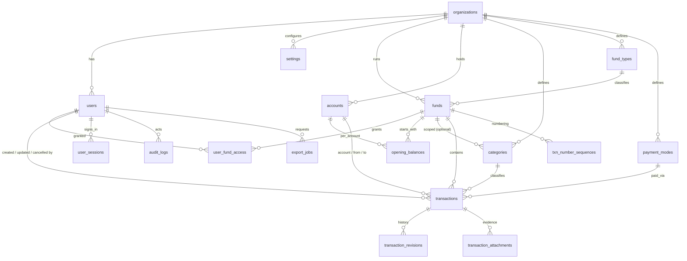

# FundLedger — Backend Schema

| Item | Value |
|---|---|
| Document | Backend Schema v1.0 |
| Derived from | PRD v1.1 §6, §7, §12, §14, §24 · [01-TRD](01-TRD.md) |
| DDL (source of truth) | [`database/schema.sql`](../database/schema.sql) |
| Verification | [`database/verify_schema.sql`](../database/verify_schema.sql) — asserts balances, business rules and RLS |
| Database | PostgreSQL 16+, schema `fl` |
| Date | 06-Oct-2026 · rev 1.1 on 07-Oct-2026 (PIN-only auth, receipts) |

> **Verified.** `schema.sql` and `verify_schema.sql` were run against PostgreSQL 16 on 07-Oct-2026 (rev 1.1), and all checks passed.
>
> What was checked:
> - fund and account balances for the PRD §13 example
> - BR-001, BR-005, BR-008, BR-010, BR-012, BR-013, BR-017 and BR-019
> - immutability of cancelled transactions
> - revision bump on edit
> - append-only audit log
> - tenant RLS and fund-level RLS
> - pre-auth lookup without tenant context

---

## 1. Conventions

| Topic | Convention |
|---|---|
| Naming | `snake_case` tables and columns; plural table names. EF Core uses `UseSnakeCaseNamingConvention()`. |
| Keys | `uuid` PKs generated by the app as **UUIDv7** (time-ordered, index friendly, safe to create offline). Exception: `audit_logs.id` is a `bigint` identity column. |
| Money | `numeric(18,2)`. Always positive (`CHECK amount > 0`); direction is derived from the type. Never `float` or `money`. In C# use `decimal`; in JSON use a string. |
| Business date/time | `txn_date date` + `txn_time time(0)` are entered by the user in the **org timezone** (PRD §7.1). |
| System timestamps | `timestamptz` in UTC (`created_at`, `updated_at`, …). |
| Tenancy | Every tenant table has `organization_id uuid NOT NULL` with RLS. |
| Soft state | Deactivate with `is_active` / `status`. Financial and audit rows are **never deleted**. |
| Enums | PostgreSQL enums for closed sets (types, statuses). Lookup tables for org-configurable sets (categories, payment modes, fund types). |
| Concurrency | `transactions.revision` (incremented by trigger) is exposed as the ETag. Other entities use the Npgsql `xmin` concurrency token. |

---

## 2. Entity-relationship diagram



Mapping to the core tables in PRD §24.1:

| PRD table | Implemented as |
|---|---|
| Organizations | `organizations` |
| Users | `users` |
| Roles | `user_role` enum (ADMIN, MEMBER) + per-fund permission flags in `user_fund_access`. A separate Roles table adds nothing for two fixed roles (ADR-0003). |
| UserFundAccess | `user_fund_access` |
| Funds, FundTypes | `funds`, `fund_types` |
| Accounts, AccountTypes | `accounts` + `account_kind` enum (CASH, BANK, UPI, WALLET, OTHER) |
| Categories | `categories` |
| Transactions | `transactions` |
| TransactionAttachments | `transaction_attachments` |
| AuditLogs | `audit_logs` |
| Settings | `settings` (key/value JSONB) + typed columns on `organizations` |
| *(added)* | `opening_balances`, `payment_modes`, `txn_number_sequences`, `transaction_revisions`, `user_sessions`, `login_attempts`, `export_jobs` |

---

## 3. Data dictionary

### 3.1 `organizations`

| Column | Type | Null | Notes |
|---|---|---|---|
| id | uuid | PK | |
| name | varchar(150) | no | |
| short_code | varchar(10) | no | Unique globally (future SaaS) |
| contact_mobile, contact_email, address | | yes | Address is printed on receipts |
| registration_number | varchar(60) | yes | Trust/society registration no., printed on receipts (ADR-0007) |
| currency_code | char(3) | no | `INR` (PRD: configurable later) |
| timezone | varchar(64) | no | IANA, default `Asia/Kolkata` |
| date_format | varchar(20) | no | default `dd-MMM-yyyy` |
| max_active_users | smallint | no | 1–50, default 50 (BR-001) |
| is_active | bool | no | Disabling blocks all logins for the org |

### 3.2 `users`

| Column | Type | Null | Notes |
|---|---|---|---|
| id | uuid | PK | |
| organization_id | uuid | no | FK |
| full_name | varchar(120) | no | |
| mobile_e164 | varchar(15) | no | `+919876543210`; unique per org; CHECK on E.164 format |
| email | citext | yes | |
| role | user_role | no | ADMIN / MEMBER |
| status | user_status | no | ACTIVE / INACTIVE. **Trigger enforces the active-user limit.** |
| pin_hash | text | yes | PBKDF2 via ASP.NET Identity `PasswordHasher`; null until the Admin sets a temporary PIN |
| pin_set_at | timestamptz | yes | Lockout counting restarts here after a set or reset |
| pin_must_change | bool | no | true after an Admin set or reset; the user must choose their own PIN (TRD TR-018) |
| last_login_at | timestamptz | yes | PRD §5.4 |
| deactivated_at / _by | | yes | |
| created_by / updated_by + timestamps | | | `created_by` is null only for the bootstrap admin |

> **Mobile number uniqueness:** V1 is single-tenant, so `(organization_id, mobile_e164)` is unique.
>
> For future multi-org SaaS, one mobile number may belong to several orgs. In that case, login adds an organization picker after the PIN check. This is already supported because `auth_find_user_by_mobile` returns a set.

### 3.3 `funds`

| Column | Type | Null | Notes |
|---|---|---|---|
| id | uuid | PK | |
| fund_type_id | uuid | no | FK `fund_types` |
| code | varchar(10) | no | Unique per org; used in transaction numbers; locked after the first transaction (API rule) |
| name | varchar(120) | no | Unique per org |
| description, start_date, end_date | | yes | CHECK end ≥ start |
| status | fund_status | no | DRAFT / ACTIVE / CLOSED / ARCHIVED |
| closed_at / closed_by | | yes | |

The fund's **opening balance** is derived: `SUM(opening_balances.amount)` for that fund. See ADR-0004.

### 3.4 `user_fund_access`

The PK is `(user_id, fund_id)`. Each row carries six permission flags:

| Flag | Default |
|---|---|
| `can_money_in` | true |
| `can_money_out` | true |
| `can_transfer` | false |
| `can_view_reports` | true |
| `can_export` | false |
| `can_view_all_txns` | true |

How access works:
- Admins need no rows; they have implicit full access.
- Removing a row revokes access immediately. This is the only table where the app role may `DELETE`.

### 3.5 `accounts` and `opening_balances`

**`accounts`**
- Accounts belong to the organization, not to a single fund, so one cash box or bank account can hold several funds' money. Balances are always reported per (fund, account).
- `account_number_last4` is the only bank identifier stored (privacy).

**`opening_balances`**
- One row per (fund, account), with `amount ≥ 0` and `as_of_date`.
- Only Admins can change it (BR-015, API-enforced). Every change writes `OPENING_BALANCE_CHANGED` to the audit log with the old and new value and a reason.

### 3.6 `categories`

| Column | Notes |
|---|---|
| direction | MONEY_IN / MONEY_OUT (PRD §21.3) |
| fund_id | Null means the category is available to all funds; set means fund-specific (e.g. "Tent" only for Ijtema) |
| name | Unique per (org, direction, scope), case-insensitive |
| icon | lucide icon name |
| is_active, sort_order | |

### 3.7 `payment_modes`, `fund_types`

These are org-configurable lookups.

`payment_modes.requires_reference` makes the API require `reference_number`, for example for UPI transaction IDs and cheque numbers.

### 3.8 `transactions` (PRD §24.2)

| Column | Type | DEPOSIT | EXPENSE | TRANSFER | ADJUSTMENT |
|---|---|---|---|---|---|
| id | uuid | ● | ● | ● | ● |
| organization_id, fund_id | uuid | ● | ● | ● | ● |
| txn_number | varchar(30) | ● | ● | ● | ● |
| txn_type | enum | ● | ● | ● | ● |
| amount | numeric(18,2) > 0 | ● | ● | ● | ● |
| txn_date, txn_time | date, time | ● | ● | ● | ● |
| category_id | uuid | ● (IN) | ● (OUT) | ✕ | ○ |
| account_id | uuid | ● | ● | ✕ | ● |
| from_account_id / to_account_id | uuid | ✕ | ✕ | ● (≠) | ✕ |
| adjustment_direction | enum | ✕ | ✕ | ✕ | ● |
| payment_mode_id | uuid | ● | ● | ○ | ○ |
| received_from | varchar(120) | ○ | ✕* | ✕* | ✕* |
| paid_to | varchar(120) | ✕* | ○ | ✕* | ✕* |
| purpose | varchar(300) | ● | ● (BR-008) | ○ (API requires) | ● (= reason) |
| reference_number | varchar(80) | ○ / ● if mode requires | same | ○ | ○ |
| remarks | text | ○ | ○ | ○ | ○ |
| status | ACTIVE / CANCELLED | ● | ● | ● | ● |
| client_txn_id | uuid, unique per org | ○ | ○ | ○ | ○ |
| source | ONLINE / OFFLINE / IMPORT | ● | ● | ● | ● |
| client_created_at | timestamptz | offline only | | | |
| revision | int | ● (trigger) | | | |
| created_by/at, updated_by/at, cancelled_by/at, cancellation_reason | | per §7.1 | | | |

Legend: ● required · ○ optional · ✕ must be null (DB CHECK) · ✕* null by API convention.

Two rules beyond the column table:
- The category's direction must match the transaction type: MONEY_IN for DEPOSIT, MONEY_OUT for EXPENSE. A CHECK constraint can't see the category row, so this is enforced in the API.
- An integration test asserts it.

### 3.9 `transaction_revisions`

- Each row is a full JSONB snapshot of the transaction **after** a revision, with `change_reason`, `changed_by` and `changed_at`.
- Revision 1 is written at creation.
- The table is append-only (trigger + grants). It feeds the "History" diff on S07.

### 3.10 `transaction_attachments`

- Metadata only: `storage_key`, original filename, content type, size, `sha256`, uploader.
- Attachments are never deleted. Admins hide them with `is_hidden` and a reason.

### 3.11 `audit_logs`

| Column | Notes |
|---|---|
| id | bigint identity (strict insertion order) |
| organization_id, user_id, fund_id | user may be null for system events |
| action | Codes from [App Flow §8](02-App-Flow.md#8-audit-event-catalogue-maps-prd-142) |
| entity_type, entity_id | e.g. `Transaction`, uuid |
| old_value, new_value | JSONB. Only changed fields for updates, the full object for creates. **Secrets are never included.** |
| reason | Required for edits by Admin, cancellations and opening balance changes |
| request_id, ip_address, device_info | Correlation and forensics |

Protection:
- **Append-only:** a trigger raises on UPDATE or DELETE, and the app role has no UPDATE or DELETE grant.
- **Readable by Admins only** through a restrictive RLS policy.

### 3.12 Auth tables

**`user_sessions`**
- One row per refresh token. Only the hashed token is stored.
- `family_id` links a chain of rotated tokens. If a token that was already rotated (`replaced_by` set) is presented again, every session in that family is revoked.

**`login_attempts`**
- One row per PIN login attempt (mobile, user if known, success, failure code, IP, user agent). **PINs are never stored.**
- Lockout is computed from it per mobile number, for unknown numbers too, so a lockout does not reveal whether a number is registered (TRD TR-013).
- The table has no tenant: it is used before authentication, so it is not under RLS. The app role may only SELECT and INSERT.
- A cleanup job deletes rows older than 90 days. Routine purges like this are documented in §9.

### 3.13 `txn_number_sequences`, `export_jobs`

**`txn_number_sequences`**
- Primary key `(fund_id, period_key)`.
- Allocation: `INSERT … ON CONFLICT DO UPDATE SET last_value = last_value + 1 RETURNING last_value`, inside the same transaction as the ledger insert. This makes numbers gap-free and race-safe.

**`export_jobs`**
- Queue for asynchronous exports.
- `(requested_by, idempotency_key)` is unique, so a double-click creates only one job.

---

## 4. Balance computation (PRD §12.3–§12.4)

Balances are **computed from transactions**, never stored ([ADR-0004](adr/ADR-0004-balance-model.md)).

| View | Definition |
|---|---|
| `v_account_movements` | One signed row per account effect for **ACTIVE** transactions: DEPOSIT +, EXPENSE −, ADJUSTMENT ±, TRANSFER − on `from` and + on `to` |
| `v_fund_account_balances` | Per (fund, account): opening, money_in, money_out, transfers_in, transfers_out, adjustments_net, **closing_balance** |
| `v_fund_balances` | Per fund: the sum of the above. **Transfers net to zero** (BR-011). |

The two closing-balance formulas:

```
Account closing = opening + in − out + transfers_in − transfers_out ± adjustments   (PRD §12.4)
Fund closing    = Σ account opening + in − out ± adjustments                         (PRD §12.3)
```

All three views are `security_invoker`, so the caller's RLS applies to them.

**Point-in-time balances** (for the date-range and daily reports) filter `v_account_movements` by `txn_date < :from` or `txn_date <= :date`.

**Worked example** (verified by `verify_schema.sql`):

| Event | Main Cash | Bank | Fund |
|---|---|---|---|
| Opening | 5,000 | 10,000 | 15,000 |
| + Deposit 25,000 (Cash) | 30,000 | 10,000 | 40,000 |
| − Expense 8,500 (Cash) | 21,500 | 10,000 | 31,500 |
| ⇄ Transfer 20,000 Cash → Bank | 1,500 | 30,000 | 31,500 (unchanged) |
| ± Adjustment −100 (Cash) | 1,400 | 30,000 | 31,400 |
| + Deposit 99,999 then **cancelled** | 1,400 | 30,000 | 31,400 (excluded) |

---

## 5. Settings keys

Settings are stored in `settings(organization_id, key, value jsonb)` and validated against a typed C# `OrganizationSettings` record.

| Key | Type | Default | Ref |
|---|---|---|---|
| `auth.pin_max_failures` | int 3–10 | 5 | TRD TR-013 |
| `auth.pin_lockout_minutes` | int 5–1440 | 15 | TRD TR-013 |
| `auth.session_idle_minutes` | int 15–1440 | 480 | TRD TR-015 |
| `auth.session_absolute_days` | int 1–30 | 7 | TRD TR-015 |
| `txn.edit_window_minutes` | int 0–1440 | 15 | §14.3 |
| `txn.backdate_days_member` | int 0–365 | 7 | TRD §7.2, decision Q-03 |
| `txn.max_amount` | decimal string | `"1000000.00"` (₹10,00,000) | Decision Q-07 |
| `txn.number_period` | `"FY_APR"` \| `"CALENDAR"` | `"FY_APR"` | §21.5, decision Q-08 |
| `txn.block_negative_account` | bool | false | App Flow §4.3 |
| `receipt.enabled` | bool | true | ADR-0007 |
| `receipt.footer_text` | string ≤ 200 | "Computer-generated receipt. No signature required." | ADR-0007 |
| `receipt.show_recorded_by` | bool | true | ADR-0007 |
| `attachments.max_mb` | int 1–20 | 5 | §18 |
| `attachments.allowed_types` | string[] | jpeg, png, webp, pdf | §18 |
| `offline.enabled` | bool | true | §19 |
| `offline.max_queue_age_hours` | int | 72 | TRD TR-043 |

---

## 6. Row-Level Security

| Layer | Tables | Policy |
|---|---|---|
| Tenant | All tenant tables | `organization_id = current_setting('app.org_id')` (USING + WITH CHECK), `FORCE ROW LEVEL SECURITY` |
| Fund | `funds`, `transactions`, `opening_balances`, `transaction_revisions`, `transaction_attachments` | **RESTRICTIVE** `fl.has_fund_access(fund_id)`: Admin, or a `user_fund_access` row exists |
| Audit | `audit_logs` | **RESTRICTIVE** SELECT only when `app.is_admin` |
| Pre-auth | `users`, `user_sessions` | Read only through `SECURITY DEFINER` functions owned by `fundledger_auth_definer` (BYPASSRLS, NOLOGIN) |

How the API uses it:
- **Session context:** the API sets `app.org_id`, `app.user_id` and `app.is_admin` at the start of each transaction, as transaction-local settings (TRD TR-002, ADR-0008).
- **No context means no rows.** This was verified: a query without context returns 0 users.
- **"Own transactions only" is enforced in the API, not RLS.** For Members without `can_view_all_txns`, the API applies a `created_by = me` filter. It isn't in RLS because Members still need to see other users' transactions as aggregate totals on the dashboard (decision Q-05: Members see all transactions by default).

---

## 7. Indexing

| Index | Serves |
|---|---|
| `ix_txn_fund_date (fund_id, txn_date DESC, txn_time DESC)` | Ledger default sort and date-range filters |
| `ix_txn_fund_status (fund_id, status) INCLUDE (txn_type, amount)` | Dashboard totals, balance views (index-only scans) |
| `ix_txn_account / from_account / to_account` (partial) | Account balance and account filter |
| `ix_txn_category` (partial) | Category report and filter |
| `ix_txn_created_by (created_by, created_at DESC)` | User activity report, "my transactions" |
| `ix_txn_ref` (partial) | Reference number search |
| `ix_txn_search_trgm` (GIN, pg_trgm) | Free-text search over purpose / received_from / paid_to / remarks |
| `uq_txn_number`, `uq_txn_client_id` | Lookup by number; idempotent sync |
| `ix_audit_org_created`, `ix_audit_entity`, `ix_audit_user` | Audit log screens |

Before release, run `EXPLAIN (ANALYZE, BUFFERS)` against 1 M seeded transactions for the ledger, dashboard and every report. Enable `pg_stat_statements` in staging and production.

---

## 8. Database roles & grants

| Role | Login | BYPASSRLS | Rights |
|---|---|---|---|
| `fundledger_owner` | CI migrations only | no | Owns schema `fl`; DDL |
| `fundledger_app` | via login role `fl_api_<env>` | **no** | SELECT/INSERT/UPDATE on tenant tables. **No DELETE** on transactions, revisions, attachments or audit. DELETE only on `user_fund_access`. INSERT-only on `audit_logs` and `transaction_revisions`. |
| `fundledger_readonly` | via `fl_ro_<env>` | no | SELECT on everything (still subject to RLS); used for support queries |
| `fundledger_auth_definer` | **no** | yes | Owns only the two pre-auth lookup functions |

Each environment has separate login roles and passwords, stored in the secrets manager.

---

## 9. Data retention & deletion

| Data | Retention | Mechanism |
|---|---|---|
| Transactions, revisions, attachments, audit logs | **Indefinite** (financial records) | Never deleted by the app (BR-012). Exception: legal deletion requests are handled by a documented DBA procedure with an approval record. |
| Users | Indefinite (they own historical transactions) | Deactivate. Personal-data erasure request: replace name with "Former member #n", null the mobile/email, and keep the ID. |
| `user_sessions` | 30 days after expiry/revocation | Worker purge |
| `login_attempts` | 90 days | Worker purge |
| `export_jobs` + files | 24 h for files, 90 days for job rows | Worker purge + bucket lifecycle rule |
| Backups | PITR 7 days; daily dumps 30 days; monthly dumps 12 months | Provider + off-site bucket lifecycle |

---

## 10. EF Core mapping notes

Configuration:
- `DbContext` uses `UseNpgsql(...).UseSnakeCaseNamingConvention()`.
- Enums are mapped with `MapEnum<T>("fl.txn_type")` and similar.
- `HasDefaultSchema("fl")`.

Global query filters:
- Every tenant entity has the global filter `organization_id == _tenant.OrgId`. This duplicates RLS so that bugs show up in tests, even though RLS already protects production.

Insert-only behaviour:
- Revisions and audit rows are written through a dedicated `IAuditWriter` that only calls `Add`. EF change tracking never updates them.

Migrations:
- **The first migration embeds `database/schema.sql`** (`migrationBuilder.Sql(...)`), so the triggers, RLS, views and grants exist exactly as verified.
- Later migrations are EF-generated plus hand-written SQL for policies and views.
- CI runs `verify_schema.sql` after `dotnet ef database update` on a fresh database, so the two cannot drift apart.

Other rules:
- Money is `decimal` with `HasPrecision(18,2)`, and there is a `Money` value object in the domain.
- Concurrency: `transactions.revision` is a concurrency token; other entities use `UseXminAsConcurrencyToken()`.
