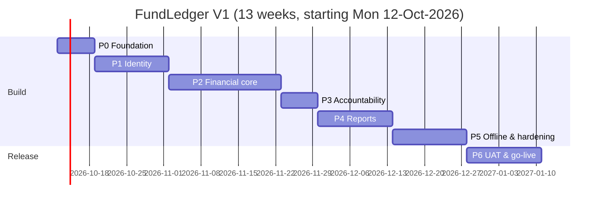

# FundLedger — Implementation Plan

| Item | Value |
|---|---|
| Document | Implementation Plan v1.0 |
| Derived from | PRD v1.1 §28 (MVP / Release Plan) · [01-TRD](01-TRD.md) · [02-App-Flow](02-App-Flow.md) · [04-Backend-Schema](04-Backend-Schema.md) |
| Date | 06-Oct-2026 · rev 1.1 on 07-Oct-2026 (owner decisions applied) |
| Assumed team | 1 full-stack developer + AI pair, with part-time product owner/tester. Durations scale down with more people. |
| Cadence | 1-week sprints with a demo at the end of each sprint to the product owner |

---

## 1. Timeline overview

The plan follows the six phases in PRD §28, plus a Phase 0 for setup. Phases 2–4 are vertical slices, so a usable ledger exists from week 5.

| Phase | Weeks | Outcome | PRD |
|---|---|---|---|
| 0 — Project foundation | W1 | Repo, CI, environments, skeletons, ADRs signed off | — |
| 1 — Foundation (identity) | W2–W3 | Admin/users, mobile + PIN login, roles, fund access | §28 Ph1 |
| 2 — Financial core | W4–W6 | Funds, accounts, categories, opening balances, In/Out/Transfer, ledger, balances | §28 Ph2 |
| 3 — Accountability | W7 | Audit log, edit rules, cancellation, revisions, detail screen, adjustment | §28 Ph3 |
| 4 — Reports | W8–W9 | Dashboard, 10 reports, XLSX/CSV/PDF async export, Money In receipts | §28 Ph4, ADR-0007 |
| 5 — Offline & hardening | W10–W11 | IndexedDB outbox, sync, idempotency, attachments offline, security and restore testing | §28 Ph5 |
| 6 — Production | W12–W13 | UAT, load test, ZAP, go-live, handover, onboarding | §28 Ph6 |

**Target go-live: week of 11-Jan-2027.**

All blocking decisions were made on 07-Oct-2026 (TRD §18). The only remaining dependency is the **domain name**, which is needed by W12 for production (P6-01). There is no hard event date, so the standard plan applies.

---

## 2. Phase 0 — Project foundation (W1)

| ID | Task | Done when |
|---|---|---|
| P0-01 | Monorepo layout: `api/` (.NET 10 solution per TRD §3.2), `web/` (Vite React TS), `database/`, `docs/`, `infra/` | Both apps build locally |
| P0-02 | `.gitignore` + `.env.example`. Gitleaks pre-commit hook and CI step. GitHub push protection on. | A test secret commit is blocked |
| P0-03 | Branch protection on `main`: PR required, checks required, no force push | Direct push rejected |
| P0-04 | Docker Compose for local: Postgres 16, MinIO, Mailpit. `make dev` / `npm run dev` scripts. | One command brings everything up |
| P0-05 | CI workflow: build, lint, typecheck, unit tests, schema verify (`schema.sql` + `verify_schema.sql`), dependency audit | Green on an empty PR |
| P0-06 | EF Core initial migration embedding `schema.sql`. RLS session interceptor (TRD TR-002). | `verify_schema.sql` passes after `ef database update` |
| P0-07 | API skeleton: ProblemDetails, request ID, Serilog JSON, health checks, OpenAPI, rate limiter, CORS allowlist, security headers | `/health/ready` is green; headers checked by test |
| P0-08 | Web skeleton: router, layout shells (bottom nav / sidebar), design tokens (Design Brief §3), dark mode, i18n scaffold, PWA manifest + service worker | Lighthouse PWA installable |
| P0-09 | Generated TypeScript API client from OpenAPI (CI fails if the generated client is stale) | |
| P0-10 | Staging environment: DB (branch), API container, static PWA, object storage bucket, secrets in the platform store | A staging deploy from `main` works |
| P0-11 | Sentry (API + web), uptime monitor on staging `/health/ready`, billing alerts | Test error visible in Sentry |
| P0-12 | Sign-off on ADR-0001…0006 and decisions on the open questions (TRD §18) | Decisions recorded in the ADRs |

**Exit criteria:** an empty app deploys to staging automatically from `main`, with observability live.

### Phase 0 status (07-Oct-2026)

| ID | Status | Notes |
|---|---|---|
| P0-01 | ✅ Done | `api/` (.NET 10 modular monolith), `web/` (React 19 + Vite PWA), `database/`, `infra/`, `docs/` |
| P0-02 | ✅ Done | `.gitignore`, `.env.example` files, Gitleaks job in CI. **Owner:** turn on GitHub push protection (Settings → Code security). |
| P0-03 | ⏳ Owner | Branch protection on `main`. This is a repo setting, so I did not change it without approval; see [deployment.md §C](ops/deployment.md). |
| P0-04 | ✅ Done | `docker-compose.yml` (Postgres 17 on 5433 + MinIO). Mailpit dropped, because there is no email or OTP in V1. |
| P0-05 | ✅ Done | `ci.yml`: API build/test (Testcontainers), schema drift + business rules, web lint/typecheck/test/build, Docker image build, secret scan, vulnerable-package checks |
| P0-06 | ✅ Done | EF initial migration embeds the verified schema. Tenant context per transaction (ADR-0008). Neon prod/staging baselined (`database/ops/2026-10-07_baseline_ef_history.sql`). |
| P0-07 | ✅ Done | ProblemDetails with codes, request IDs, Serilog JSON, health live/ready, OpenAPI, rate limiter, CORS allowlist, security headers, `migrate` command |
| P0-08 | ✅ Done | Router with all App Flow routes, mobile bottom-nav and desktop sidebar shells, design tokens with dark mode, i18n, PWA manifest/icons/service worker with update prompt, offline banner |
| P0-09 | ✅ Done | `api/openapi/fundledger-api.json` generated on build → typed client `web/src/lib/api/schema.d.ts`. CI fails if either is stale. |
| P0-10 | 🟡 Partly done | Neon staging is ready, and deploy pipeline/scripts are written (`deploy.yml`, `infra/vps`). **Waiting on:** domain, VPS SSH access, Cloudflare account, GitHub environment secrets. |
| P0-11 | 🟡 Partly done | Sentry SDK is wired in (enabled when a DSN is set). **Waiting on:** Sentry and Better Stack accounts, billing alerts. |
| P0-12 | ✅ Done | ADR-0001 to ADR-0008 accepted |

**Verified on 07-Oct-2026:**
- 38 API tests passed: 23 unit and 15 integration, including 6 database tests run against Neon through the pooler.
- 14 web tests passed.
- Release build with zero warnings; no vulnerable packages; EF model in sync.
- `schema.sql` and the migrations produce an identical schema (catalog comparison on Neon).
- The API ran locally against Neon staging: `/health/ready` returned 200.

**Not yet run anywhere:** the Docker image build and the GitHub Actions workflows. Docker Desktop would not start on the dev machine. Both run on the first PR.

**Deferred to the phase that needs them:**
- Lighthouse CI (Phase 2, when real screens exist)
- Sentry source-map upload (when the Sentry account exists)
- axe accessibility tests (Phase 2)

---

## 3. Phase 1 — Foundation / Identity (W2–W3)

| ID | Task | Screens | Tests |
|---|---|---|---|
| P1-01 | Bootstrap CLI (`fundledger bootstrap`) + optional `/setup` wizard; default lookups seeded | S03 | Integration |
| P1-02 | Domain: Organization, User, UserFundAccess; 50-user limit (API check + DB trigger mapped to 409) | — | Unit + concurrency test (51 parallel activations, exactly 50 succeed) |
| P1-03 | Auth: `POST /auth/login` (mobile + PIN), `PasswordHasher`, dummy-hash timing equalization, `login_attempts` lockout, weak-PIN rules, restricted session until `pinMustChange` is cleared | S01, S02 | Integration: lockout after 5 failures; identical response for unknown/inactive/wrong PIN; weak PINs rejected |
| P1-04 | Sessions: JWT ES256 (15 min), refresh rotation with reuse detection, logout, revoke-on-deactivate | — | Token reuse test; logout-then-reuse test (Standard §2.8) |
| P1-05 | Per-IP rate limit on login (TRD TR-013); Admin PIN reset with session revocation; user PIN change; Admin session list/revoke | S17, S19 | Reset revokes sessions; timing parity test |
| P1-06 | `GET /me`; client auth store (access token in memory, refresh via cookie) | — | E2E login |
| P1-07 | Users admin: list, create, edit, status, fund access grid with presets | S18, S19 | Integration + E2E |
| P1-08 | Authorization framework: policies, `IFundAccessGuard`, **two-user IDOR test harness** used by every later endpoint | — | Template test |
| P1-09 | Audit writer (`IAuditWriter`) + auth/user events | — | Unit |

### Phase 1 status (07-Oct-2026)

| ID | Status | Notes |
|---|---|---|
| P1-01 | ✅ | `bootstrap` operator command creates org + first Admin (temporary PIN printed once) + default lookups. The browser `/setup` wizard is deferred: a CLI is safer for a one-time action. |
| P1-02 | ✅ | 50-user limit: API check and DB trigger; tested incl. inactive users not counting |
| P1-03 | ✅ | `POST /auth/login`, `PasswordHasher`, timing equalisation, per-mobile lockout (also unknown numbers), weak-PIN rules, restricted session until PIN change |
| P1-04 | ✅ | ES256 15-min JWT, rotating refresh cookie, theft detection with parallel-tab race window, logout/deactivation/reset revoke server-side, per-request session check |
| P1-05 | ✅ | Per-IP login rate limit; PIN reset; session list/revoke |
| P1-06 | ✅ | `GET /me`; PWA keeps access token in memory, single-flight cross-tab refresh |
| P1-07 | ✅ | Users list + user form with fund-access grid and presets, deactivate, reset PIN, sessions |
| P1-08 | ✅ | `FundAccessGuard` and the two-user IDOR test suite |
| P1-09 | ✅ | Audit writer; auth and user events, with masked mobiles and no secrets |
| P1-10 | n/a | OTP provider adapter dropped (PIN-only, ADR-0002) |

**Verified:** 106 API tests (incl. DB tests on Neon via the pooler) and 26 web tests pass.
**Found and fixed:** the baseline SQL's blanket function grant failed on a fresh non-superuser database (Neon); EF created a new internal service provider per request until the enum translator was shared.
**Not yet done:** browser walkthrough of the new screens; production/staging need `Auth__Jwt__SigningKeyPem` (`generate-jwt-key`) before deploy.

**Exit criteria (from PRD §29):**
- An Admin-created active user can log in.
- Inactive and unregistered users cannot log in.
- The 51st activation is rejected.

---

## 4. Phase 2 — Financial core (W4–W6)

| ID | Task | Screens | Tests |
|---|---|---|---|
| P2-01 | Funds: CRUD, lifecycle (draft → active → closed → archived), fund types | S20, S21 | State machine unit tests |
| P2-02 | Accounts CRUD; opening balances per (fund, account) with reason + audit | S21, S22 | BR-015 test |
| P2-03 | Categories (direction, fund scope, ordering), payment modes | S23, S24 | |
| P2-04 | Ledger write service: validation pipeline (TRD §7.2), numbering, revision 1, audit | — | Unit + integration per business rule |
| P2-05 | Endpoints `deposit` / `expense` / `transfer`; `clientTxnId` idempotency on the online path too | — | Duplicate POST returns the same transaction |
| P2-06 | Balance views exposed via `/accounts/balances`, fund balance in responses | — | Worked example (Schema §4) as an integration test |
| P2-07 | UI: `AmountInput`, `ChipGroup`, `AccountPicker`, `DateTimeField`, `ConfirmSheet` | — | Storybook + axe |
| P2-08 | Money In / Money Out / Transfer forms with smart defaults, "Add another" | S08, S09, S10 | E2E: entry in ≤ 30 s scripted path |
| P2-09 | Ledger list: grouping, search, filters, sort, totals bar, cursor paging; desktop table | S06 | Integration on filter combinations |
| P2-10 | Fund switcher + global fund context; closed-fund read-only behaviour | S05 | E2E |
| P2-11 | Basic dashboard (balance card, quick actions, recent); full version in Phase 4 | S04 | |

### Phase 2 status (08-Oct-2026)

| ID | Status | Notes |
|---|---|---|
| P2-01 | ✅ | Fund CRUD and lifecycle Draft → Active → Closed → Archived (+ reopen with reason); code locks after the first transaction |
| P2-02 | ✅ | Accounts CRUD; opening balances per (fund, account), reason required on an active fund, audited (BR-015) |
| P2-03 | ✅ | Categories (direction, fund scope), payment modes (requires reference), fund types |
| P2-04 | ✅ | Ledger write pipeline (TRD §7.2): permission → fund active → references/dates → FY number → insert → revision 1 → audit |
| P2-05 | ✅ | `deposit` / `expense` / `transfer`; `clientTxnId` idempotency (200 + original entry on retry, 409 for someone else's id) |
| P2-06 | ✅ | `/accounts/balances`, fund balance in every create response; the PRD worked example is an integration test |
| P2-07 | 🟡 | `AmountInput`, `ChipGroup`, confirm dialog built. Storybook and axe checks deferred to the first polish pass |
| P2-08 | ✅ | Money In / Out / Transfer forms: defaults from last use, confirm step, "Add another" gets a new client id. The scripted ≤ 30 s E2E timing test is deferred to Phase 6 UAT |
| P2-09 | 🟡 | Ledger: date groups, search, filters, sort, totals, paging. **Deviations:** paging cursor is an opaque offset (not keyset); no separate desktop table (the responsive list is used on desktop too) |
| P2-10 | ✅ | Fund switcher; closed fund is readable but entry is disabled with an explanation |
| P2-11 | ✅ | Dashboard: balance, in/out, today, quick actions, account balances, recent |

**Deviations from the App Flow doc (decided while building):**
- Activating a fund does **not** require an opening-balance row. A fund can start at zero.
- Transaction detail is read-only for now. Edit, cancel, history and the audit screen are Phase 3.

**Verified:** all API tests pass against Neon, 37 web tests pass, and the app was driven in a browser against a real Neon branch. The PRD example (opening 5,000 cash / 10,000 bank; +25,000; −8,500; transfer 20,000) gives cash ₹1,500, bank ₹30,000, fund ₹31,500.

**Found and fixed:**
- The typed web client lost every server error message (a second read of an already-read response body), which also affected Phase 1's screens.
- Query-string enums (`?type=EXPENSE`, `?status=ACTIVE`) did not bind. A new `EnumQuery<T>` binder accepts the wire form in any case.
- A startup check ran too early and made the OpenAPI generator emit an empty contract (and I had committed it). It is now a hosted service, and CI asserts the contract has paths.

**Exit criteria (from PRD §29):**
- Money In, Money Out and Transfer are recorded with all required fields.
- Transfers don't change the fund total.
- Balances are correct.
- A closed fund rejects new transactions.
- A user cannot access an unassigned fund (IDOR suite green).

---

## 5. Phase 3 — Accountability (W7)

| ID | Task | Screens | Tests |
|---|---|---|---|
| P3-01 | Transaction detail with accountability card and attachments strip | S07 | |
| P3-02 | Edit: window rule, Admin reason, `If-Match` / 412, revision snapshot, field diff | S12 | Concurrency test (two editors) |
| P3-03 | Cancel: Admin, reason, terminal state, excluded from balances | S07 | BR-013 + balance test |
| P3-04 | History / diff view from `transaction_revisions` | S07 | |
| P3-05 | Adjustment (Admin) with direction + reason | S11 | BR-016 test (Member → 403) |
| P3-06 | Audit log screen with filters + diff view + CSV export | S25 | Member → 404 test |
| P3-07 | Attachments online: upload, magic-byte check, re-encode images, signed download, hide | S07, S08/S09 | Cross-fund attachment access → 404 |

**Exit criteria (from PRD §29):**
- Creation, modification and cancellation are audited.
- No hard-delete path exists. This is verified both by an API route scan test and by the DB grants.

### Phase 3 status (09-Oct-2026)

| ID | Status | Notes |
|---|---|---|
| P3-01 | 🟡 | Detail returns what the caller may do (`canEdit`, `canCancel`, `editableUntil`, `editRequiresReason`) with the revision as `ETag`. The attachments strip waits for P3-07 |
| P3-02 | ✅ | `PUT /transactions/{id}` needs `If-Match` (428 without it, 412 on a stale revision; a 4-way race lets exactly one win). Member: own entry, inside `txn.edit_window_minutes`, still holding the capability. Admin: any active entry, reason required. Same validation as new entries; a category or account turned off later can be kept. Saving with no change writes no revision |
| P3-03 | ✅ | Admin-only cancel with reason (≥ 5 chars), `If-Match`, terminal. The entry stays listed but leaves every balance. Cancelling now bumps the revision (migration `Accountability`, `guard_transactions()`) so it is a step in the history like an edit |
| P3-04 | ✅ | `GET /transactions/{id}/history`: Recorded / Edited / Cancelled with who, when, reason and old → new values by field name |
| P3-05 | ✅ | `POST /transactions/adjustment` (Admin; reason ≥ 10 chars; increase or decrease one account). Adjustments are corrected by cancel + re-record, so the web has no edit form for them |
| P3-06 | ✅ | `GET /audit-logs` (date range in org time, user, action group or action, fund, free text; paged) and `/audit-logs/export`. **Deviation:** the CSV is built synchronously and capped at 5,000 rows; bigger exports belong to the async export pipeline (TRD §10.2). Cells starting with `= + - @` are neutralised; the export itself is audited |
| P3-07 | ⏸ | **Deferred to its own PR.** It needs the R2 bucket and credentials (an owner action) and a decision on the image re-encoding library and its licence |

**Verified:** all API tests pass against Neon, including the new accountability suite (edit window, reason, 412/428, a race, cancel, adjustments, history, audit filters/paging/tenant scope, CSV injection, no DELETE routes). Web tests cover detail, edit with `If-Match`, cancel, the 412 message, the audit screen and the Admin-only routes. The edit → cancel → adjustment → audit flow was also driven in a browser against the staging Neon branch.

**Found and fixed:**
- Filtering the audit log by date returned 500, because Npgsql only accepts UTC `timestamptz` parameters.
- The audit CSV had no UTF-8 BOM (`Encoding.GetBytes` never writes one), so Excel would garble non-English names.

---

## 6. Phase 4 — Reports (W8–W9)

| ID | Task | Screens | Tests |
|---|---|---|---|
| P4-01 | Full dashboard: today strip, account balances, sync banner, 30-day chart, top categories | S04 | |
| P4-02 | Report query layer for the 10 reports (TRD §10.1) incl. point-in-time opening balances | — | Golden-file tests on a fixed seed dataset |
| P4-03 | Report hub + viewer (summary cards, table, mobile cards), "My transactions only" scope | S14, S15 | Permission-scope tests (BR-020) |
| P4-04 | Export pipeline: `export_jobs`, worker, ClosedXML / CsvHelper / QuestPDF, private bucket, 60 s signed URL, 24 h expiry | S16 | Idempotency-Key test; audit `EXPORT_PERFORMED` |
| P4-05 | PDF layout: header, footer, page numbers, Indian grouping, totals | — | Visual snapshot |
| P4-06 | Settings screen (incl. receipt settings, org registration number) | S26 | Audit test |
| P4-07 | Money In receipt: `GET /transactions/{id}/receipt.pdf` (QuestPDF, A5), Indian amount-in-words, CANCELLED watermark, revision tag, verification code, `RECEIPT_GENERATED` audit; PWA "Share receipt" via Web Share API with download fallback | S07, S08 success | Amount-in-words unit tests (lakh/crore/paise); non-deposit returns 400; cross-fund access returns 404; p95 < 1 s |

**Exit criteria (from PRD §29):**
- Daily, date-range, user-wise, category-wise and account-wise reports match hand-computed values on the seed dataset.
- A Money In receipt can be generated and shared from an Android phone, and a cancelled transaction's receipt shows the CANCELLED watermark.
- An authorized export works.
- An unauthorized export returns 403.

### Phase 4 status (09-Oct-2026)

| ID | Status | Notes |
|---|---|---|
| P4-01 | 🟡 | Dashboard adds the 30-day in/out chart and top five spending categories (desktop), read from the report endpoints so they always agree with Reports. The sync banner belongs to Phase 5 (offline) |
| P4-02 | ✅ | `ReportService` computes all ten reports (TR-060 opening balances, TR-061 scope). A hand-worked dataset (opening 5,000 cash / 10,000 bank; +25,000, −8,500, transfer 20,000, +1,000 by a Member, a cancelled 300, an adjustment −100 → cash 1,400, bank 31,000, fund 32,400) is checked report by report. **Deviation:** golden files are replaced by those hand-computed assertions in the integration tests |
| P4-03 | ✅ | `/reports` hub and `/reports/:code` viewer: period presets (incl. Indian financial year), account/category filters, summary cards, table on desktop and cards on phones, "My transactions only" label. A Member without "see all" gets no fund-wide opening/closing balances, because they would reveal other people's entries |
| P4-04 | 🟡 | `POST /exports` (Idempotency-Key) → job → CSV / XLSX / PDF → download, 24 h life, audited as `EXPORT_PERFORMED`, owner-only access, 403 without `can_export`. **Deviations:** (1) the runner is a background service **inside the API process**, not the Worker, because the Worker cannot read other tenants' queue rows under RLS without a new SECURITY DEFINER claim function; a job lost to a restart is reported as failed after 10 minutes. (2) The finished file is stored in the job row (`content bytea`, emptied at expiry) and downloaded through the API, not a 60 s signed bucket URL, because there is no R2 bucket yet. (3) CSV is written by hand (same neutralising code as the audit export) instead of CsvHelper. Both (1) and (2) move when attachments land |
| P4-05 | ✅ | PDF layouts: header, footer with org/fund/period/"Generated by", page X of Y, Indian grouping, repeated table header. **Deviation:** snapshots are rendered to PNG by tests (`DocumentLayoutTests`) for a human to review, not pixel-compared. PDFs print "Rs." because the rupee sign is missing from many fonts |
| P4-06 | ✅ | `GET/PUT /settings` and the Settings screen: organization profile (incl. registration number), transaction limits, sign-in limits, receipt options. Currency and the numbering period are fixed in V1. Saving lists what will change first; one `SETTINGS_CHANGED` event records old → new values. Attachment and offline settings join in Phases 3b and 5 |
| P4-07 | ✅ | `GET /transactions/{id}/receipt.pdf`: A5, Indian amount-in-words (unit-tested: lakh/crore/paise), "Revised (rev n)", CANCELLED watermark with date, 8-character HMAC verification code, `RECEIPT_GENERATED` audit, 60/hour/user limit, same access as the entry (404 otherwise), Money In only (400 otherwise). Web: **Share receipt** (Web Share API with download fallback) on the success screen and **Receipt (PDF)** on the detail screen. Not yet exercised on a real Android phone |

**Verified:** reports match the hand-computed values; exports, receipts, settings, scopes and IDOR checks are integration tests; web tests cover the hub, viewer, export flow, receipt download and settings. The report viewer, export, dashboard charts and settings were driven in a browser against the staging Neon branch, and receipt/report PDF layouts were rendered to images and read.

**Found and fixed:**
- QuestPDF 2026.9 **throws** when any glyph is missing from the font. Latin-only Lato would have failed every receipt and report containing a Hindi, Gujarati or Urdu name. System fonts are now used as fallback, a missing glyph no longer fails the document, and the Docker image installs Noto fonts (the image build was not run here).

**Owner decisions needed:**
- **QuestPDF licence.** The code sets the free *Community* licence. Confirm your organization qualifies (free for non-profits and for businesses under a revenue limit; check the current terms on questpdf.com) before go-live, or buy a licence.
- The verification code on receipts has no public check page yet; an Admin can compare it with a freshly generated receipt.

---

## 7. Phase 5 — Offline & hardening (W10–W11)

| ID | Task | Tests |
|---|---|---|
| P5-01 | Dexie stores (`outbox`, `refdata`, `ledgerCache`); refdata refresh strategy | Unit |
| P5-02 | Sync engine: triggers, backoff, state machine (App Flow §4.8), user binding of outbox | Unit with fake timers |
| P5-03 | `POST /sync/transactions` batch endpoint: per-item transaction, CREATED / DUPLICATE / REJECTED / RETRY | Race test: same batch sent twice in parallel produces no duplicates (PRD §29) |
| P5-04 | Pending-sync UI: top-bar indicator, S13 screen, needs-attention edit/discard | E2E with Playwright `context.setOffline(true)` |
| P5-05 | Offline attachments (Blob in IndexedDB → upload after sync) | E2E |
| P5-06 | Service worker caching strategy: app shell precache, API `NetworkOnly` (no stale financial data from the SW cache), update prompt | Lighthouse + manual |
| P5-07 | Security pass: authz matrix review, OWASP ZAP baseline on staging, header audit, dependency audit, secret scan of history | Findings triaged by severity; 0 high/critical open |
| P5-08 | Backup: PITR confirmed, nightly off-site encrypted dump job, **first restore drill** recorded in `docs/ops/restore-log.md` | Restored DB passes verify + balance reconciliation |
| P5-09 | Rollback rehearsal: deploy N, deploy N+1, roll back to N in under 2 minutes on staging | Timed and recorded |
| P5-10 | Performance: seed 1 M transactions; `EXPLAIN ANALYZE` the ledger, dashboard and reports; fix any plan regressions | NFR table in TRD §13 |

**Exit criteria (from PRD §29):**
- An offline transaction syncs after reconnection.
- The same client transaction cannot be inserted twice.

### Phase 5 status (09-Oct-2026)

| ID | Status | Notes |
|---|---|---|
| P5-01 | ✅ | Dexie stores `outbox`, `refdata`, `ledgerCache`, plus `meta` (last signed-in profile, no secrets) and `discards`. Reference data (accounts, modes, categories, balances, `/me`, dashboard) is remembered on every successful load and used when the server can't be reached; the ledger remembers the last 200 entries per fund |
| P5-02 | ✅ | Sync engine: runs on app start, when the connection returns, on "Sync now" and every 60 s while something waits; 50 per request, oldest first; exponential backoff 30 s → 15 min; rejected entries are never retried automatically; entries are bound to their user and never sent under another; one run at a time across tabs (Web Locks); a session that ended (401) keeps everything queued. Unit tests with fake time cover each rule |
| P5-03 | ✅ | `POST /sync/transactions`: each entry in its own DB transaction through the same code as an online entry, so every rule is re-checked (TR-041). Results CREATED / DUPLICATE / REJECTED / RETRY. The race test sends the same 5-entry batch four times in parallel: exactly 5 entries, gap-free numbers, no errors. The device clock is kept as `client_created_at` for audit only (TR-042); entries older than the limit (`offline.max_queue_age_hours`, default 72) sync but are flagged `OFFLINE_ENTRY_STALE` (TR-043). `POST /sync/discard` records `OFFLINE_ENTRY_DISCARDED` |
| P5-04 | 🟡 | Entry forms save to the outbox when offline or when the request can't get through (same client id both ways); top-bar indicator (offline / needs attention / N waiting / synced); the Waiting-to-sync screen with Edit & retry and a confirmed Discard; pending entries appear at the top of the ledger; edit and cancel are disabled offline with "Needs internet connection". **Deviation:** covered by Vitest component tests, not Playwright `setOffline` (no browser-automation project yet) |
| P5-05 | ⏸ | Offline attachments need attachments (P3-07) first |
| P5-06 | ✅ | The service worker precaches the app shell only, with no runtime caching, so API answers are never served from its cache (ADR-0005). First-route JS is 161 KB gzip (target < 250 KB). Lighthouse is not run yet |
| P5-07 | 🟡 | **Done:** an authorization-matrix test lists every public route and fails if a new one appears unannounced, checks that every other route refuses an anonymous caller (401) and every Admin route refuses a Member; security-header test; `npm audit` and `dotnet list package --vulnerable` clean; git history searched for credentials (only documentation placeholders). **Not done:** OWASP ZAP baseline (needs a deployed staging) |
| P5-08 | ⏸ | Needs the VPS and an off-site storage account: nightly encrypted dump job and the first restore drill |
| P5-09 | ⏸ | Needs a deployed staging to rehearse the rollback |
| P5-10 | 🟡 | Opt-in capacity test (`FUNDLEDGER_PERF_ROWS`) seeds a large fund, times the screens and prints query plans; run it from a machine close to the database, because every request makes several round trips (76 ms each from a laptop to Neon Singapore). **Finding below: computed balances are the one path that does not scale to the largest sizes.** Not run at 1 M rows (free Neon storage) |

**Capacity finding (P5-10), measured in the database with a 240,000-entry organization (200,000 in one fund):**

| Query | Time |
|---|---|
| Ledger page (newest 50) | 0.5 ms (index scan) |
| Load one fund-year for a report | 12 ms for 60,000 rows |
| `v_fund_balances` / `v_fund_account_balances` for the big fund | **~720 ms** (about 140 ms for a 40,000-entry fund) |

The balance views read every active entry of the fund each time (ADR-0004 computes balances, TR-034 allows a stored balance only when needed). That is linear: roughly 3.5 s for 1 M entries in one fund, against a 300 ms target for the dashboard, and it runs on every dashboard load and in every create response. For the sizes in the PRD (about 500 entries a day at the peak per fund, so 60,000 or fewer in a busy week and a few thousand for an event like Ijtema) it is well inside the target; it only matters for a fund that keeps growing for years. Options, in order of effort: (1) rewrite the views as three grouped passes: tested, same answers, 2.2× faster (338 ms); (2) add a covering index so those passes are index-only; (3) keep a running balance per fund and account (TR-034). Not changed in this phase: it touches the money views, and the real data is far smaller. Reports load a whole fund-year into memory, which is fine at these sizes (12 ms for 60,000 rows) and should become SQL aggregation if funds reach hundreds of thousands of entries.

**Offline behaviour worth knowing**
- With no connection and a token that has expired, the app opens as the last signed-in user (their public profile is remembered on the device, no token or PIN) and entering continues; the token is renewed when the connection returns. On sign-out, or when the server refuses the session, the remembered profile and cached data are removed; queued entries stay, bound to their user.
- A rejected entry stays in the outbox until the user fixes or discards it; nothing is forced in.

**Deviation for the owner to know:** the cached data and the remembered profile are readable by anyone who can unlock the device while the app is open offline. This is the same exposure as the refresh cookie the browser already keeps.

---

## 8. Phase 6 — Production (W12–W13)

| ID | Task | Done when |
|---|---|---|
| P6-01 | Production environment provisioned (separate Neon branch, R2 bucket, keys, domain, TLS) | Smoke tests pass |
| P6-02 | k6 load test on staging: 50 VUs, mixed traffic, 10 min | p95 targets met |
| P6-03 | UAT with 5–8 real users on staging using the Ijtema 2026 sample setup (PRD App. B). Script covers every PRD §29 row. | All criteria signed off by the product owner |
| P6-04 | Timed entry test (≤ 30 s median), hallway test of ledger readability | Recorded |
| P6-05 | PWA installation test: Android Chrome, Samsung Internet, desktop Chrome/Edge, iOS Safari (best effort) | Checklist |
| P6-06 | Accessibility audit: axe clean + TalkBack pass on the critical path | 0 serious |
| P6-07 | Privacy notice for members (what data is stored, who sees it); internal data-handling note | Published in More → About |
| P6-08 | Ops runbook: deploy, rollback, restore, rotate secrets, Admin PIN-reset procedure, brute-force alert response, incident and post-mortem template | `docs/ops/` |
| P6-09 | Go-live: bootstrap production org, create the fund, accounts, categories and users from the PRD App. B list; Admins hand out temporary PINs in person | Admin logs in on production |
| P6-10 | Admin handover session (1 h) + user onboarding (15 min, one-page guide with screenshots in English, plus Hindi/Urdu if needed) | Guides in `docs/guides/` |
| P6-11 | Hypercare: 2 weeks of daily Sentry/uptime/sync-rejection review; weekly check-in with the Admin | Issues triaged |

---

## 9. Definition of Done (every story)

These items come from the AI-Directed Engineering Standard and apply to every story.

- [ ] Server-side validation + authorization. A two-user IDOR test exists for every new endpoint touching data.
- [ ] Business rule covered by unit test. API covered by integration test against real Postgres with RLS on.
- [ ] Audit event written for every mutation listed in App Flow §8.
- [ ] No secrets in code. No PII, PINs or tokens in logs.
- [ ] UI states: loading, empty, error, offline, forbidden, closed-fund.
- [ ] Accessible: labels, focus, contrast, 44 px targets; axe clean.
- [ ] Strings externalized (i18n), amounts and dates through `lib/format`.
- [ ] Migration (if any) has a rollback note and is expand-only.
- [ ] Docs updated: TRD / App Flow / Schema when behaviour changes; new ADR for any non-trivial technical decision.
- [ ] Deployed to staging via CI and demoed.

---

## 10. Fast-track option

Not needed. The product owner confirmed there is no hard event date (decision Q-10, 07-Oct-2026). The full 13-week plan applies.

---

## 11. Risks & mitigations

| # | Risk | Likelihood | Impact | Mitigation |
|---|---|---|---|---|
| R1 | PIN-only login is a single factor: shared or observed PINs, guessing | Medium | High | Lockout per mobile + IP limits, weak-PIN rules, Admin session list/revoke, full audit, 8 h idle timeout. Revisit OTP/passkeys for Admins (ADR-0002). |
| R2 | Volunteers on low-end phones and poor network | High | High | Offline outbox, a small bundle budget, client image compression, 360 px design target |
| R3 | Data-entry mistakes (wrong amount or category) | High | Medium | Confirmation sheet, 15-minute self-edit window, Admin edit with reason, cancellation |
| R4 | Insider misuse (silent edits, hidden deletions) | Low | High | No delete anywhere, append-only audit + revisions at DB level, the creator always visible |
| R5 | Offline duplicates or conflicts | Medium | High | Client UUIDs + DB unique constraint, server re-validation, NEEDS_ATTENTION state (never auto-forced) |
| R6 | Lost data due to hosting failure | Low | Critical | PITR + off-site dumps + quarterly restore drills |
| R7 | Scope creep toward accounting/ERP | Medium | Medium | PRD §3.2 out-of-scope list enforced; new requests go to the PRD §30 backlog |
| R8 | iOS PWA limitations (install, background sync) | Medium | Low | Android-first per PRD; sync triggers on app open/online, so it doesn't rely on Background Sync |
| R9 | Single developer bus factor | Medium | High | ADRs, this doc set, CLAUDE.md, runbooks, CI-enforced checks |

---

## 12. Decisions log

All product decisions were made on 07-Oct-2026 and are recorded in [TRD §18](01-TRD.md#18-product-owner-decisions-07-oct-2026).

| Area | Decision |
|---|---|
| Login | Mobile + PIN, no OTP (ADR-0002) |
| Hosting | Accepted (ADR-0006) |
| Policies Q-03 to Q-08 | Recorded in TRD §18 |
| Receipts | Money In receipts are in V1 (ADR-0007) |
| Schedule | No hard event date, so no fast-track |

**Still open:** the production domain name. It is needed by W12 (P6-01).
